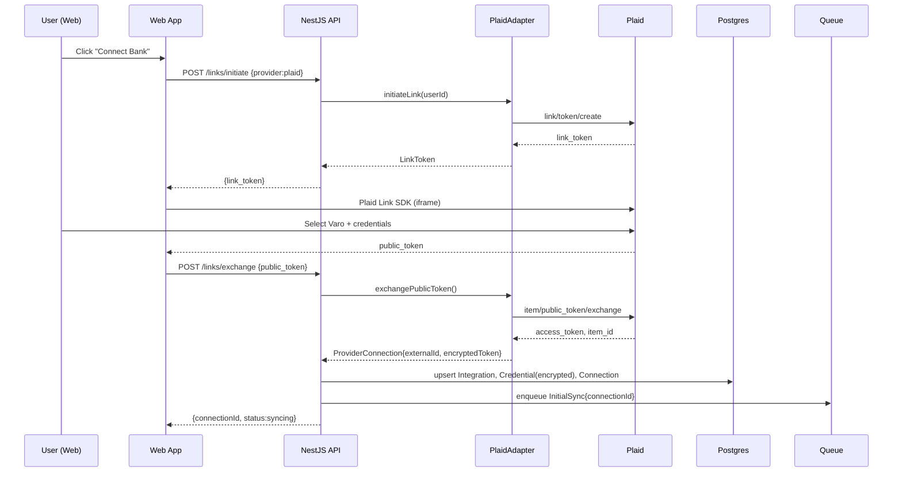
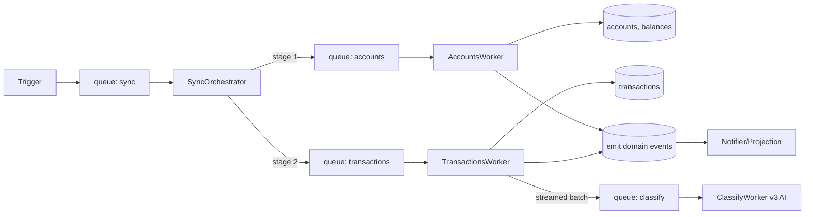
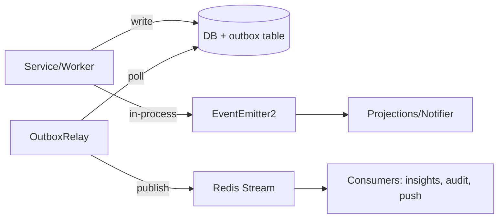
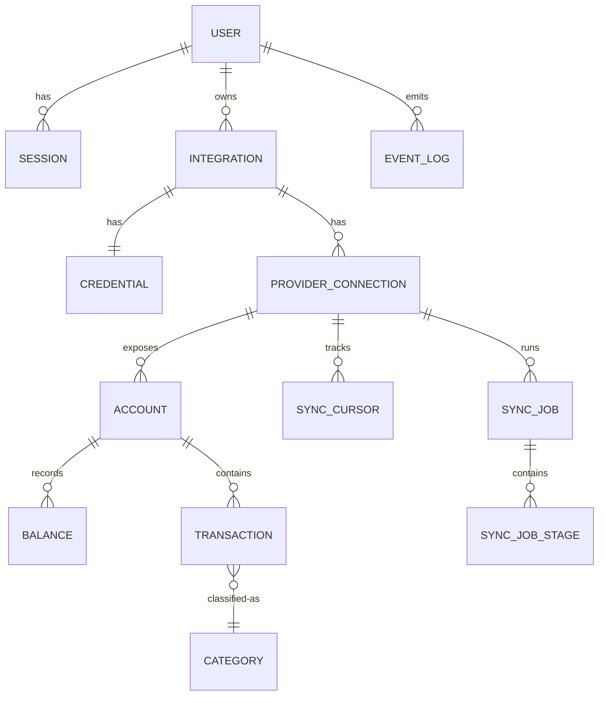
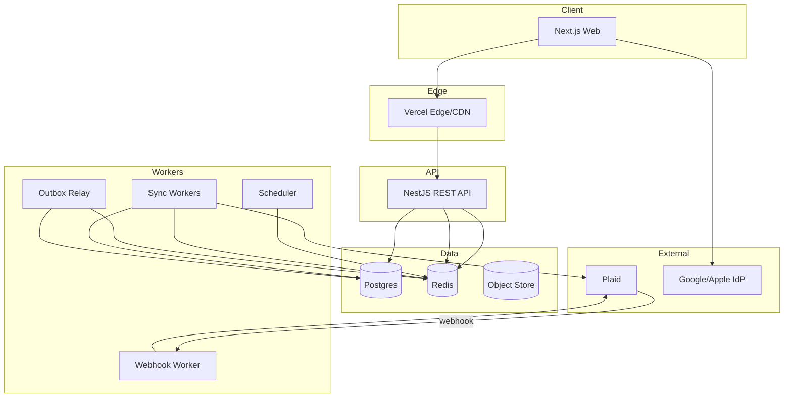
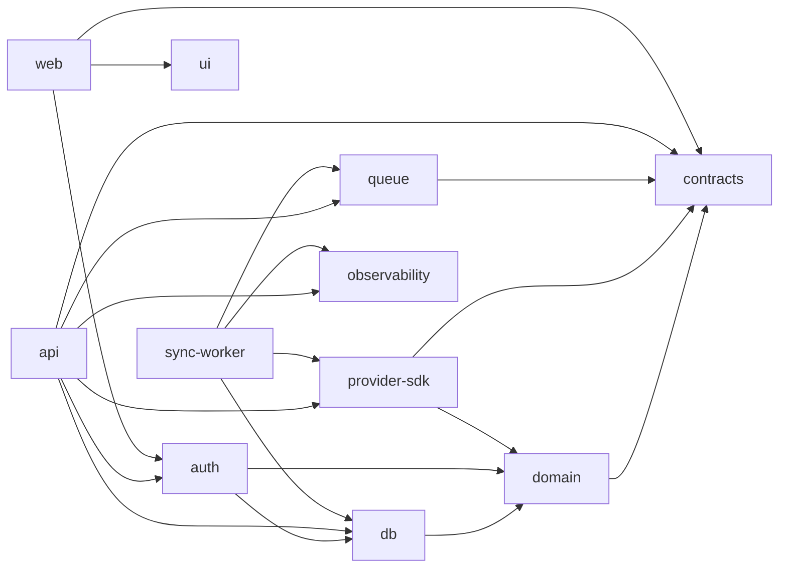
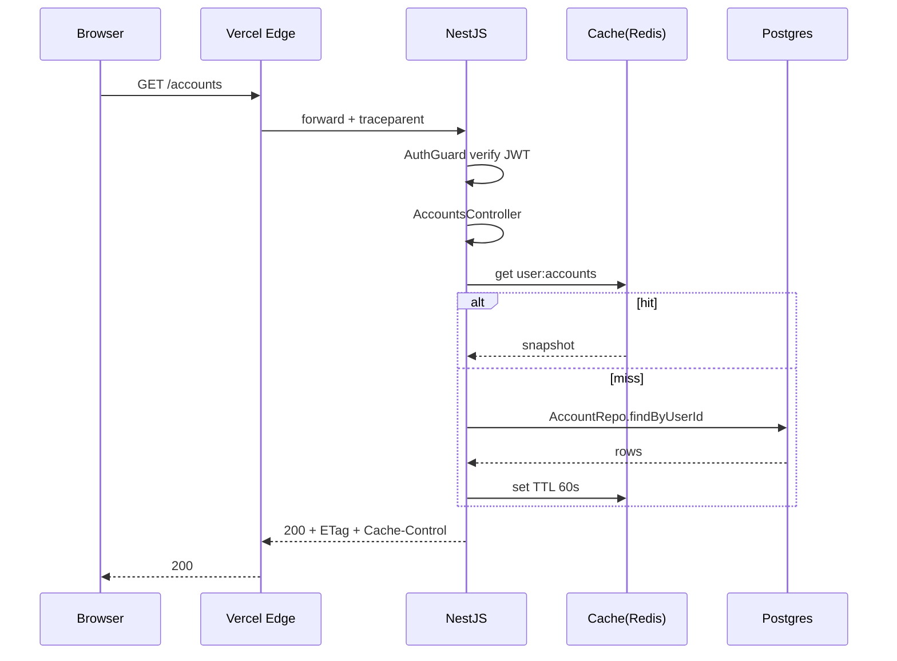
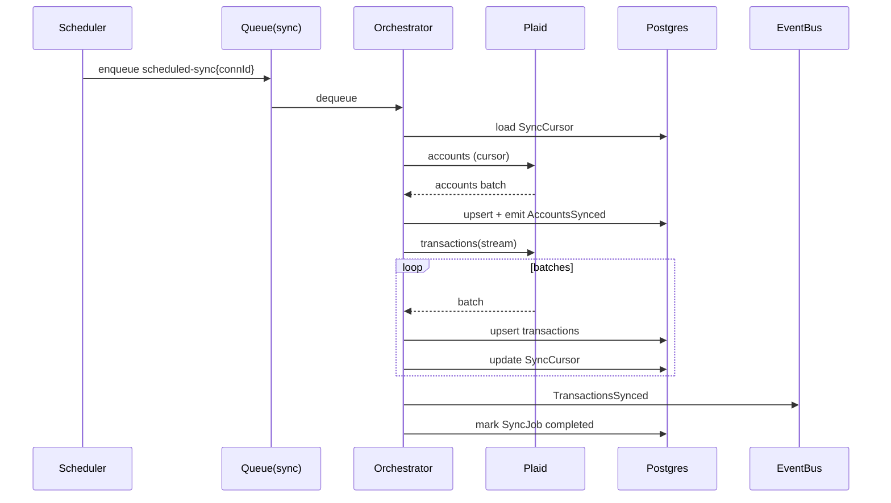

# byrdOS Engineering Plan v1.0

> Status: Accepted
> Owner: Architect
> Supersedes: —
> Superseded by: —

---

## 0. Locked Architectural Decisions

| Area | Decision |
|---|---|
| Language | TypeScript (single language across stack) |
| Monorepo | pnpm workspaces + Turborepo |
| Backend | NestJS (modular DDD, DI) |
| Frontend | Next.js App Router |
| Database | PostgreSQL (Neon/Supabase managed) + Drizzle ORM |
| Cache / Queue | Redis (Upstash) + BullMQ |
| App Auth | Auth.js (NextAuth) JWT + Postgres adapter |
| Provider Access | Aggregator-first (Plaid primary, MX/Akoya adapters) |
| v1 Scope | Accounts + Transactions + Balances (read-only) |
| Deploy | Vercel FE · Fly.io/Render BE · managed Postgres · Upstash Redis |
| Package manager | pnpm workspaces + Turborepo |
| Styling | Tailwind v4 + shadcn-based design system |
| License | MIT |
| ADR numbering | Zero-padded four-digit files; titles `ADR-0000: <Title>` |
| RFC lifecycle | `docs/rfc/` for proposals → promoted to `docs/adr/` as binding. Promotion requires user approval. |
| Diagrams | Mermaid authored inline in `.md` (GitHub-renderable) |

---

## ADR-0000 — Engineering Principles (binding)

The following principles govern all future ADRs (0001+) and all implementation milestones (M0–M6). Future ADRs inherit these principles rather than redefining them.

1. **AI-first development**
   - Code and docs are authored primarily by specialized agents.
   - Interfaces, contracts, and tests are written before impl bodies.
   - Optimized for agent comprehension: small files, single responsibility, explicit types, predictable patterns, no clever abstractions.
   - All edits retain a clear audit trail (git log) so any agent can reconstruct prior decisions from history alone.

2. **Graphify as canonical architectural memory**
   - Graphify is the source of truth for components, services, relations, and decisions. The repository is *not* its own documentation.
   - Every significant change (component added, dependency introduced, decision made) MUST be accompanied by a Graphify update task.
   - Implementation agents consult Graphify before reading source; they read source only for the specific references Graphify returns.
   - Stale Graphify state is a defect, tracked like any other bug.

3. **Domain-driven design**
   - Every feature lives inside a bounded context; cross-context calls occur via domain events, never via direct service imports.
   - Aggregates are consistency boundaries; repositories persist one aggregate per transaction.
   - Domain package (`packages/domain`) has zero I/O and zero framework imports — it is the only layer a junior agent can read in isolation.

4. **Modular architecture and clear ownership boundaries**
   - Each bounded context is one NestJS module and one folder tree.
   - Each package has a single owning agent; edits by other agents require that owning agent's review (the Architect coordinates).
   - Boundaries are enforced mechanically by `eslint-plugin-boundaries` in CI, not by convention alone.
   - No circular dependencies between packages or modules.

5. **Provider-agnostic integrations**
   - No provider-specific type or concept crosses the `IProviderAdapter` boundary. Leaky adapters are rejected in review.
   - The first concrete adapter (Plaid) MUST be implemented without any Plaid-specific field surfacing in services, DTOs, or domain.
   - Adding a second provider (MX, Akoya, direct bank) MUST be possible by introducing a new adapter file and registering it — no service or schema change.

6. **Security-first development**
   - Threat model is reviewed at every milestone gate (Architect + Security).
   - Secrets are never logged, never committed, never returned in API responses. pino redaction paths are mandatory.
   - Credentials/tokens stored as envelope-encrypted blobs; the encryption key never resides in the database.
   - Every user-facing endpoint enforces per-user authorization; multi-tenancy isolation is checked in tests, not assumed.
   - Destructive DB changes require explicit human approval; never automated.

7. **Interface-first design**
   - For any cross-package or cross-service interaction, the interface lives in `contracts`/`domain` and is published before implementations.
   - Implementation agents receive the interface and the matching test contract; they never invent the interface themselves unless the ADR explicitly delegates that authority.
   - OpenAPI is generated from contracts/DTOs, not hand-written.

8. **Testing requirements**
   - No PR merges without affected tests passing under turbo cache miss.
   - Domain layer ≥ 95% coverage; repositories/services ≥ 85%; adapters ≥ 85% with fixture-driven HTTP mocks; e2e for critical human flows.
   - Tests use ephemeral Postgres schemas; no shared test database.
   - Tests are deterministic; no time/clock reliance without injected clock abstraction.

9. **Documentation standards**
   - Every significant decision is recorded in an immutable ADR; ADRs are never edited after Accept — a superseding ADR is authored.
   - Module-level READMEs only when wiring is non-obvious; otherwise see ADR-0000 + Graphify.
   - Mermaid diagrams authored inline in `.md` (GitHub-renderable).
   - Public API spec at `/docs` (OpenAPI) generated from code.

10. **Token optimization**
    - Agents load only Graphify-referenced files, never a full tree walk.
    - File scope per implementation task is bounded; Architect ensures context windows stay minimal.
    - Reuse existing DTOs, events, and types rather than paraphrasing.
    - Avoid re-reading unchanged files; trust Graphify's `lastUpdated` metadata to skip stale re-indexing.

11. **Observability-first engineering**
    - Observability is designed in alongside the feature, not bolted on after.
    - Every service exposes structured logs (pino), metrics, and OTEL traces from day one.
    - Every cross-context call and every external provider call is a span boundary.
    - Alert targets and SLOs are defined before a milestone exits M-Stage.

**Consequences:**
- Slower initial velocity in M0/M1, faster from M2 onward.
- Higher discipline overhead at every PR; repaid in agent handoff efficiency and fewer regressions.
- Future ADRs defer to these principles; any exception MUST cite the principle being overridden and the explicit Architect approval.

---

## 1. Monorepo Structure

```
byrdos/
├─ apps/
│  ├─ web/                      # Next.js (App Router) — user dashboard
│  └─ api/                      # NestJS REST/GraphQL gateway
├─ services/
│  ├─ sync-worker/              # BullMQ worker process (sync pipeline)
│  ├─ webhook-worker/           # Inbound provider webhooks
│  └─ scheduler/                # Cron producer (enqueues sync jobs)
├─ packages/
│  ├─ config/                   # eslint, tsconfig, prettier shared
│  ├─ tsconfig/                 # base tsconfigs per runtime
│  ├─ domain/                   # Pure domain models, value objects, events (no I/O)
│  ├─ contracts/                # OpenAPI / Zod DTOs shared FE↔BE
│  ├─ provider-sdk/             # Aggregator adapters (plaid, mx, akoya) + common iface
│  ├─ db/                       # drizzle schema (TS), migrations, client re-export
│  ├─ auth/                     # Auth.js config, JWT helpers, session types
│  ├─ queue/                    # BullMQ queue defs, job base classes
│  ├─ observability/            # Logger (pino), metrics, tracing init
│  ├─ ui/                       # Design system (shadcn-based) shared by web
│  └─ test-utils/               # Mock factories, db test harness
├─ docs/
│  ├─ architecture/
│  ├─ adr/
│  ├─ rfc/
│  ├─ roadmap/
│  └─ diagrams/
├─ .agents/                     # Skill + agent definitions (already exists)
├─ turbo.json
├─ pnpm-workspace.yaml
└─ AGENTS.md
```

### Package responsibility matrix

| Package | Owns | Depends on | Agent |
|---|---|---|---|
| `domain` | Entities, VOs, domain events, pure logic | nothing | Backend |
| `contracts` | Request/response schemas (Zod), OpenAPI types | `domain` | API |
| `provider-sdk` | `IProviderAdapter` interface + Plaid/MX/Akoya impls | `domain`, `contracts` | API |
| `db` | Schema (Drizzle TS), migrations, client singleton | `domain` | Backend |
| `queue` | Queue names, job payloads, retry policy defs | `contracts` | Backend |
| `auth` | NextAuth config, JWT sign/verify, session strategy | `db`, `domain` | Security |
| `observability` | pino logger, OTEL tracer, metrics helpers | nothing | DevOps |
| `ui` | shadcn/ui components, tokens, themes | nothing | Frontend |
| `apps/api` | Controllers, service composition, DI wiring | all BE packages | Backend |
| `services/*` | Long-running processes | `queue`, `domain`, `provider-sdk` | Backend |
| `apps/web` | Routes, pages, data fetching | `ui`, `contracts`, `auth` | Frontend |

**Boundary rule:** `domain`, `contracts`, `observability`, `ui` may not import from `apps/` or `services/`. `apps/api` is the only place that wires concrete implementations to interfaces.

---

## 2. Domain-Driven Design

### Bounded contexts

| Context | Aggregates | v1? |
|---|---|---|
| `Identity` | `User`, `Session` | ✅ |
| `ProviderLink` | `Integration`, `Credential` (encrypted), `Connection` | ✅ |
| `Account` | `Account` (per provider account), `Balance` | ✅ |
| `Transaction` | `Transaction`, `TransactionCategory` | ✅ |
| `Sync` | `SyncJob`, `SyncCursor` | ✅ |
| `Budget` | `Budget`, `Category` | 🔜 v2 |
| `Transfer` | `Transfer` | 🔜 v2 (write) |
| `Insight` | `Insight`, `Anomaly` | 🔜 v3 (AI) |

Each context = one NestJS module (`@Module`) exposing only application services & DTOs. Cross-context communication is via **domain events**, not direct service calls.

---

## 3. External Integration Strategy

### The adapter contract (`provider-sdk`)

```ts
interface IProviderAdapter {
  readonly providerId: ProviderId;             // 'plaid' | 'mx' | 'akoya' | 'varo-direct'
  initiateLink(userId: UserId, returnUri: string): Promise<LinkToken>;
  exchangePublicToken(payload: LinkCallback): Promise<ProviderConnection>;
  refreshCredentials(conn: ProviderConnection): Promise<ProviderConnection>;
  listAccounts(conn: ProviderConnection): Promise<ProviderAccount[]>;
  getBalances(conn: ProviderConnection, accountIds?: string[]): Promise<ProviderBalance[]>;
  listTransactions(conn: ProviderConnection, cursor: SyncCursor, range: DateRange): AsyncIterable<ProviderTransaction>;
  revoke(conn: ProviderConnection): Promise<void>;
  handleWebhook(event: RawWebhook): Promise<WebhookResult>;
}
```

- Every method returns **provider-neutral DTOs** defined in `contracts`.
- Idempotency keys passed through by the service layer.
- A `ProviderRegistry` resolves `providerId → IProviderAdapter` via DI multi-provider.
- Avoid leaky abstractions: any Plaid-specific concept (`item_id`, `public_token`) lives **only** in the Plaid adapter; the service layer never sees it.

### Plaid-specific lifecycle notes

- Link → `public_token` → exchange → `access_token` encrypted at rest (KMS/AES-GCM, key in env not DB).
- `item_id` stored on `ProviderConnection.externalId`.
- Webhooks (`TRANSFER`, `TRANSACTIONS`, `ITEM_LOGIN_REQUIRED`) map to domain events.
- `LOGIN_REQUIRED` triggers a `RelinkRequired` event → user-facing notification.

---

## 4. Authentication & OAuth Lifecycle

### App auth (byrdOS users)

- Auth.js Credentials + Google + Apple providers.
- JWT strategy with short-lived access (15m) + refresh (30d, rotating).
- Sessions table in Postgres for revocation/audit.
- Backend verifies JWT via shared JWKS/public key (asymmetric RS256).

### Provider OAuth lifecycle (Plaid)



### Token refresh & relink

- `access_token` for aggregators is long-lived; the issue is `ITEM_LOGIN_REQUIRED` (credentials changed) → user re-links.
- If direct OAuth (Varo-direct fallback in future): refresh tokens stored encrypted; proactive refresh 7 days before expiry via scheduled job.
- All token writes audit-logged (no token values, only `tokenId` + `expiresAt`).

---

## 5. Synchronization Pipeline

### Types of sync

| Sync type | Trigger | Scope |
|---|---|---|
| Initial | On link complete | Full historical (default 30/90/365d configurable) |
| Incremental | Cron (every 4h) + webhook | Since last cursor |
| On-demand | User "Refresh now" | Since last cursor |
| Backfill | Manual/admin | Specified range |

### Pipeline stages (BullMQ flows)



- **Orchestrator** = BullMQ `FlowProducer` parent that fans out child jobs (`accounts`, `transactions`) and aggregates their state.
- Each worker is independently retriable; partial failures do not roll back successes.
- Transactions worker uses **cursor-based pagination** from provider; stores last cursor on `SyncCursor`.
- Idempotency: `Transaction.externalId + accountId` unique constraint → upserts.
- Rate-limiting: BullMQ `limiter` per provider (`max`, `duration`). Plaid-specific rate codes (`PRODUCTS_NOT_READY`) → backoff with jitter.
- Sync state machine: `queued → running → accounts_done → tx_done → completed | failed | partial`.

---

## 6. Event System

- **Domain events** emitted by aggregates/services using `EventEmitter2` (NestJS) — in-process.
- **Integration events** persisted to `event_log` table (outbox pattern) → a relay worker publishes to Redis Streams for cross-service consumers.
- Events are **schema-versioned** (`v1.TransactionSynced`) and defined in `contracts`.

Key events v1:
`IntegrationLinked`, `CredentialsRefreshed`, `AccountsSynced`, `TransactionsSynced`, `BalanceChanged`, `SyncFailed`, `ReauthRequired`, `WebhookReceived`.



---

## 7. Database Schema (Drizzle)

### Entity Relationship Diagram



### Key tables

| Table | Purpose | Notable columns |
|---|---|---|
| `User` | Identity | `id`, `email`, `createdAt`, `status` |
| `Session` | Refresh token records | `id`, `userId`, `refreshHash`, `expiresAt`, `revokedAt` |
| `Integration` | Top-level link | `id`, `userId`, `providerId`, `status` |
| `Credential` | Encrypted tokens | `integrationId`, `cipher` (AES-GCM), `keyId`, `expiresAt` |
| `ProviderConnection` | Per-item mapping | `id`, `integrationId`, `externalId`, `productName`, `lastWebhookAt` |
| `Account` | Provider account | `id`, `connectionId`, `externalId`, `mask`, `type`, `subtype`, `name` |
| `Balance` | Time-series of balances | `id`, `accountId`, `current`, `available`, `currency`, `recordedAt` |
| `Transaction` | Posted txn | `id`, `accountId`, `externalId`, `amount` (int cents), `date`, `name`, `merchant`, `raw` (JSONB), `categoryHash` |
| `Category` | Classification | `id`, `userId`, `name`, `normName`, `kind` |
| `SyncCursor` | Pagination state | `connectionId`, `resourceType`, `cursor`, `updatedAt` |
| `SyncJob` | Run record | `id`, `connectionId`, `type`, `status`, `trigger`, `startedAt`, `finishedAt`, `error` |
| `SyncJobStage` | Sub-stage status | `jobId`, `stage`, `status`, `attempts`, `detail` |
| `EventLog` (outbox) | Integration events | `id`, `aggregateType`, `aggregateId`, `type`, `payload`, `version`, `publishedAt` |
| `AuditLog` | Sensitive ops | `actor`, `action`, `target`, `meta`, `at` |

### Modeling decisions

- All monetary amounts stored as **integer cents** (no float).
- `Transaction.raw` JSONB preserves provider payload for replay/audit.
- Unique `(externalId, accountId)` enforces idempotency.
- `Balance` is append-only; current balance = latest row per account (we also cache on `Account.currentBalanceCents` for fast reads + invalidate on sync).
- Soft deletes avoided; financial records are immutable, corrections are new rows.
- Encryption: `Credential.cipher` AES-256-GCM with key reference `keyId` (key not in DB).

### Drizzle-specific notes

- Schema authored in TypeScript (`packages/db/schema/*.schema.ts`) — one file per aggregate, composed via `pgTable`.
- Relations declared with Drizzle `relations()` builder; not used for queries (joins written explicitly) but enables type inference and Graphify indexing.
- Migrations generated via `drizzle-kit generate` and committed; reviewed in PR — Drizzle generator is non-deterministic across major versions, so lock `drizzle-kit` version in CI.
- Apply with `drizzle-kit migrate` in deploy job; `drizzle.config.ts` reads `DATABASE_URL` from env.
- Query builder (`db.select().from(...)`) used inside repository implementations only — never leaked to services.
- Repository interfaces (in `domain`/`contracts`) return domain entities; mapping from Drizzle rows happens inside the repository implementation.
- RLS policies authored in raw SQL migrations (Drizzle does not manage RLS declaratively) — see ADR-0008 for encryption and ADR-0010 for migration runbook.

---

## 8. Service & Repository Layers

### Layering rule (strict)

```
Controller → ApplicationService → DomainService/Repository → DrizzleClient
```

- Controllers never touch Drizzle.
- Repositories are per-aggregate, interface-driven, implemented in `db` package.
- Services depend on repository **interfaces**, not Drizzle types.

### Repositories

```ts
interface AccountRepository {
  findById(id: string): Promise<Account | null>;
  findByConnection(connectionId: string): Promise<Account[]>;
  upsertFromProvider(input: AccountUpsertInput): Promise<Account>;     // maps DTO → entity
}
```

### DI strategy (NestJS)

- Bindings per module: `@Module({ providers: [{ provide: 'AccountRepository', useClass: DrizzleAccountRepository }] })`.
- Interface string tokens (or Symbol) to keep code decoupled from concrete class.
- `provider-sdk` registers all adapters via a `ProviderModule.forRoot({ adapters: [PlaidAdapter, MxAdapter] })` → builds `ProviderRegistry`.
- Workers use standalone NestJS app contexts (not HTTP) → reuse same DI graph minus controllers.

---

## 9. Error Handling, Retry, Caching, Logging

### Error taxonomy (`packages/contracts`)

| Class | Cause | HTTP | Retryable |
|---|---|---|---|
| `ValidationError` | Bad input | 400 | no |
| `AuthError` | Missing/expired session | 401 | no |
| `ForbiddenError` | Wrong tenant | 403 | no |
| `NotFoundError` | Resource absent | 404 | no |
| `ProviderError` | Upstream 5xx/rate-limit | 502 | yes (exp backoff) |
| `ProviderAuthError` | Re-link needed | 409 | no |
| `ConflictError` | Concurrent update | 409 | client decides |
| `SyncPartialError` | Some stages failed | 207 (multi-status) | partial |
| `InternalError` | Unhandled | 500 | yes |

### Retry strategy

- Provider calls: exponential backoff `[1s,2s,4s,8s,30s]` + ±20% jitter, max 5.
- Idempotency key per logical request (`<userId>:<operation>:<hash>`).
- BullMQ: `attempts: 5`, `backoff: { type: 'exponential', delay: 2000 }`, `removeOnComplete: 100`, `removeOnFail: 1000`.
- Dead-letter queue `sync.dead` after final failure; alerting via event.

### Caching

- **Read-through** with Redis for: provider product config, rate-limit counters, JWT JWKS, accounts list (TTL 60s, invalidated on sync).
- HTTP cache headers on aggregate GETs (`Cache-Control: private, max-age=60, stale-while-revalidate=300`).
- **No caching** of balances/transactions beyond short TTL — sync events invalidate.

### Logging

- **pino** structured JSON, one logger instance per process via `observability`.
- Log fields: `reqId`, `userId`, `providerId`, `syncJobId`, `latencyMs`, `err.code`.
- Secrets auto-redaction via pino redact paths (`access_token`, `cipher`, `Authorization`).
- OTEL traces propagated W3C traceparent; spans for each provider call and sync stage.
- Levels: `error` (paged), `warn` (counter), `info` (default), `debug` (off in prod).

---

## 10. Security Considerations

| Concern | Control |
|---|---|
| Token storage | AES-256-GCM envelope; key via env/KMS; key rotation supported via `keyId`. |
| Transport | TLS 1.2+ everywhere; HSTS; mTLS between api ↔ workers optional via VPC. |
| Secrets | `.env` local; Doppler/AWS SM in prod; never committed; `gitleaks` in CI. |
| Session | Refresh token rotation + reuse detection; absolute timeout 30d. |
| CSRF | Auth.js handles; state param in OAuth; SameSite=Lax cookies. |
| Webhook authenticity | Verify Plaid signature header (`Plaid-Signature` + `plaid-version`) per request. |
| Rate limiting | `@nestjs/throttler` + Redis store; per-IP and per-user limits. |
| PII / financial data | Postgres RLS by `userId`; backups encrypted; field-level audit log. |
| Multi-tenancy | Every query carries `userId`; repository layer enforces tenant scope. |
| Dependency supply chain | Renovate + `pnpm audit` + SBOM in CI. |
| OWASP | Quarterly review; CSP headers; SRI on FE assets. |
| Compliance readiness | SOC2-aligned logging; data retention policy on `raw` (90d purge). |

---

## 11. Testing Strategy

| Layer | Tool | Coverage target |
|---|---|---|
| Domain (pure) | Vitest | 95% |
| Repositories | Vitest + testcontainers Postgres | 85% |
| Services | Vitest + mocked repos | 90% |
| Adapters (`provider-sdk`) | Vitest + nock/MSW against fixture HTTP | 85% |
| API e2e | Supertest + testcontainers | happy + critical paths |
| Workers | Vitest + in-memory BullMQ | sync flows |
| Web | Playwright + Testing Library | critical user flows |
| Contract | OpenAPI schema diff + `@stoplight/spectral` | on every PR |
| Load | k6 (staged) | pre-release smoke |
| Security | `gitleaks`, `npm audit`, OWASP ZAP baseline | nightly |

Shared harness in `packages/test-utils` provides: ephemeral Postgres schema per test file, fixture factories, fake provider server.

---

## 12. Deployment & CI/CD

### CI pipeline (GitHub Actions)

1. **on PR** — install (pnpm) → lint → typecheck → affected test (turbo) → build → spectral lint → size-limit (web).
2. **on merge to main** — build images → push to GHCR → deploy previews (Vercel preview + Render preview app).
3. **on tag** — promote images to prod → migrate job → rollout.
4. **nightly** — security scans, e2e regression, dep review.

Migrations: `drizzle-kit migrate` packaged as a one-shot job; deploy gate checks for pending migrations before app rollout. **Zero-downtime** rule: no destructive migrations without paired expand/contract PRs. Schema authored in TypeScript (`*.schema.ts`); `drizzle-kit` generates SQL migrations reviewed before commit.

### Environments

`local` → `preview` (per-PR) → `staging` (shared) → `prod`.

### Future scalability

- Split workers per resource type (already isolated) → scale independently on Fly.
- Move analytics to ClickHouse when `transactions` > 50M rows; CDC via outbox.
- Pluralize `api` behind internal gateway when modules exceed 1 service boundary.
- Event broker upgrade Redis Streams → NATS/Kafka when > 1k events/sec.
- Field-level encryption HSM when SOC2 compliance engaged.

---

## 13. Frontend Spec

### Route structure (App Router)

```
/                         → dashboard (overview)
/login, /signup            → auth
/onboarding                → first-run flow
/accounts                  → accounts list
/accounts/[id]             → account detail (balances, tx)
/accounts/[id]/transactions
/transactions               → global search/filter
/connect                    → link a provider (Plaid Link)
/settings                   → profile, integrations, security
/settings/integrations/[id] → manage connection, relink, revoke
```

### Dashboard layout

- Persistent left nav (collapsible, becomes bottom tab < md).
- Top bar: org switcher (v2), search, profile, refresh-now, notifications.
- Main grid: Net worth card, Accounts by institution, Recent transactions, Spending-by-category (v2), Sync status banner.

### Shared components (`packages/ui`, shadcn-based)

`Button`, `Card`, `Table`, `Tabs`, `Dialog`, `Skeleton`, `EmptyState`, `ErrorBoundary`, `Toast`, `AccountBadge`, `Money` (formatting), `ProviderIcon`, `SyncStatusBar`, `DataTable` (TanStack Table), `LinkProviderModal`.

### State management

- **Server state:** TanStack Query (with React Server Components prefetch on App Router).
- **URL state:** `nuqs` for filters/sort (shareable).
- **Local UI state:** React `useState` only; no global store needed for v1.
- **Form state:** `react-hook-form` + `zod` (same schemas reused from `contracts`).

### Data fetching

- Server Components prefetch on load → dehydrate to client.
- Mutations via server actions (Next.js) or API client; optimistic updates for refresh.
- Streaming with Suspense for slow sections.

### Loading / error states

- `loading.tsx` per route (skeletons matching layout).
- `error.tsx` boundary per route with retry + "contact support" escalation.
- Global `<OfflineBanner>` + sync status context provider.

### Mobile responsiveness

- Tailwind breakpoints (`sm md lg xl`).
- Mobile-first: single column → multi-column at `lg`.
- Bottom tab nav < `md`; sidebar ≥ `md`.
- Tables → card stacks < `md`.
- Touch targets ≥ 44px.

### Design system recommendations

- Tokens in `packages/ui` via CVA + Tailwind v4 tokens.
- Semantic color scale (`bg-surface`, `text-foreground`, `border-line`); light/dark via `next-themes`.
- Typography: Inter (UI), JetBrains Mono (numbers for tabular alignment).
- Spacing 4px grid; radii per token — consistency enforced by UI gate (Frontend agent).
- Accessibility: WCAG AA, focus-visible rings, `aria-*` primitives from Radix (via shadcn), keyboard nav in all DataTables.
- Motion: minimal, prefers-reduced-motion aware.

---

## 14. Backend Modules (NestJS)

| Module | Controllers | Services | Workers (BullMQ processors) |
|---|---|---|---|
| `Auth` | `SessionController` | `SessionService`, `JwtService` | — |
| `Integrations` | `IntegrationsController`, `WebhooksController` | `IntegrationService`, `ProviderRegistry`, `CredentialService` | — |
| `Accounts` | `AccountsController` | `AccountService`, `BalanceService` | — |
| `Transactions` | `TransactionsController` | `TransactionService`, `TransactionReadService` | — |
| `Sync` | `SyncController` | `SyncOrchestratorService`, `SyncStateService` | `SyncOrchestrator`, `AccountsWorker`, `TransactionsWorker`, `ClassifyWorker` (stub) |
| `Webhooks` | — | `WebhookHandlerRegistry` | `WebhookProcessor` |
| `Events` | — | `EventBus`, `OutboxRelay` | `OutboxRelayWorker` |
| `Audit` | — | `AuditService` | — |

### Scheduled jobs (BullMQ repeatable)

| Job | Schedule | Description |
|---|---|---|
| `scheduled-sync` | every 4h per active connection | enqueue incremental sync |
| `credential-refresh` | daily 03:00 | refresh soon-expiring tokens (future OAuth) |
| `outbox-relay` | poll 1s | publish pending events to stream |
| `balance-fastlane` | every 30m | light balance-only sync (Plaid `/accounts/balance/get`) |
| `retention-purge` | nightly 02:00 | drop `raw` older than 90d |
| `deadletter-alert` | poll 30m | emit alert for jobs stuck in DLQ |

### Queues

`sync`, `accounts`, `transactions`, `classify`, `webhooks`, `outbox`, `notifications`, `sync.dead` (DLQ).

---

## 15. Developer Experience

### Folder & naming conventions

- **Files:** `kebab-case.ts`; classes `PascalCase`; interfaces prefixed `I` only when needed to disambiguate from impl.
- **One aggregate per directory** under a module's `domain/` folder.
- **Tests co-located:** `account.service.ts` → `account.service.spec.ts`.
- **DTOs** `*.dto.ts`, **Entities** `*.entity.ts`, **Value Objects** `*.vo.ts`, **Events** `*.event.ts`.
- **Error code namespacing:** `<module>.<error>` e.g. `sync.provider_unreachable`.

### Code standards

- ESLint `@typescript-eslint` recommended + NestJS rules + `eslint-plugin-import` (boundary enforcement).
- Prettier (shared config).
- `eslint-plugin-boundaries` (or `dependency-cruiser`) enforces package direction rules in CI.
- Husky + lint-staged on commit; commit-msg Conventional Commits; commitizen optional.
- Bi-weekly dependency review.

### Documentation strategy

- `docs/architecture/<topic>.md` — designs (this plan expanded).
- `docs/adr/NNNN-title.md` — immutable architecture decision records.
- `docs/rfc/` — pre-decision proposals (see RFC lifecycle below).
- `docs/roadmap/milestones.md` — delivery plan.
- `docs/diagrams/*.mmd` + rendered SVG.
- Module-level `README.md` only when module has non-obvious wiring.
- OpenAPI generated from `contracts` via `@nestjs/swagger`; served at `/docs`.

### Graphify knowledge graph structure

Nodes:
`Component`, `Service`, `Module`, `Package`, `Aggregate`, `Entity`, `Controller`, `Worker`, `Queue`, `Provider`, `ADR`, `Milestone`, `Agent`.

Edges:
`belongs_to`, `depends_on`, `implements`, `owns`, `emits`, `consumes`, `assigned_to`, `described_by`.

Every API PR is accompanied by a Graphify update task; stale relationships tracked by diffing `graphify-out/` against current source.

### RFC lifecycle

| Stage | Status field | Meaning |
|---|---|---|
| 1 | `Proposed` | Submitted for review; not binding |
| 2 | `Review` | Architect + relevant specialized agents evaluating |
| 3 | `Accepted` | Becomes a new ADR (e.g., RFC-0007 → ADR-0011) — **requires user approval** |
| 4 | `Rejected` | Archived with rationale; drift reference |
| 5 | `Withdrawn` | Author pulled the proposal |

RFCs are numbered independently (`rfc-0007-title.md`, zero-padded four-digit) and link to the ADR they became on acceptance. ADRs never reference RFCs as binding — only as origin context.

### Agent responsibilities & recommended prompts

| Agent | Owns | Starter prompt |
|---|---|---|
| Architect (you) | Plan, review, Graphify | "Given ADR-007 decision, update dependency graph and milestone M3 acceptance criteria." |
| API | `provider-sdk`, `contracts`, webhooks | "Implement the Plaid adapter against `IProviderAdapter` (docs/adr/0005-provider-abstraction). All provider-specific types stay inside the adapter. Unit tests against fixtures in `packages/test-utils`. Do not touch `apps/api`." |
| Backend | `apps/api`, `services/*`, `db`, `sync`, `events` | "Implement the `SyncOrchestratorService` plus `AccountsWorker` and `TransactionsWorker` per docs/architecture/sync-pipeline.md. Use BullMQ FlowProducer. Reuse `IProviderAdapter` from provider-sdk. Idempotency via `(externalId, accountId)` unique. Tests with testcontainers." |
| Frontend | `apps/web`, `packages/ui` | "Build `accounts/[id]` route per docs/architecture/frontend.md. Use TanStack Table + RSC prefetch. Loading skeletons in `loading.tsx`. Reuse `packages/ui` Money component. Do not add new tokens without Frontend agent review." |
| Security | `packages/auth`, credential encryption, rate limit | "Review OAuth callback handler in apps/api (PR #X). Confirm state CSRF, PKCE, encrypted token write, audit log entries. Report findings only." |
| Testing | `packages/test-utils`, e2e | "Add e2e for link → initial sync → accounts appear flow using fake-provider server in test-utils. Reproduce edge cases: rate-limited 502, login_required." |
| DevOps | CI/CD, docker, observability | "Add Preview environment workflow: build FE/BE images, deploy to Vercel preview + Render preview app, run `pnpm db:migrate` (drizzle-kit). Failure must not block merge to main." |
| Documentation | ADRs, README, Graphify | "Author ADR-0006 Outbox Pattern from the design in docs/architecture/events.md. Index the resulting components into Graphify." |

---

## 16. Diagrams

### System architecture



### Package dependency graph



### Request lifecycle (read)



### Data sync flow



Event flow & OAuth flow — shown in sections 6 and 4 above.

---

## 17. Implementation Roadmap

### Milestone M0 — Foundation (1 wk)
**Objective:** runnable monorepo & CI.
- pnpm + turbo + tsconfig + eslint/prettier/boundaries
- `packages/domain`, `contracts`, `config`, `observability` skeletons
- CI: lint, typecheck, build, pr-based preview
- **Acceptance:** `pnpm install && pnpm build` green; preview deploys on PR.
- **Agent:** DevOps + Architect
- **Complexity:** Low

### Milestone M1 — Identity & Auth (1 wk)
- `db` initial schema: User, Session, AuditLog (Drizzle `*.schema.ts`)
- `packages/auth` NextAuth (credentials + Google) + JWT
- `apps/web` login/signup + protected route guard
- `apps/api` AuthGuard verifying JWT
- **Acceptance:** user can sign up, sign in, hit protected `/me`.
- **Agent:** Security + Frontend + Backend
- **Complexity:** Medium

### Milestone M2 — Provider Abstraction + Plaid Adapter (1.5 wks)
- `IProviderAdapter` in `provider-sdk`
- `PlaidAdapter` (`link/token/create`, exchange, accounts, balances, transactions, webhook verify, revoke)
- `IntegrationService`, `CredentialService` (AES-GCM envelope)
- `/links/initiate`, `/links/exchange`, `/links/revoke`
- **Acceptance:** Link flow works against Plaid sandbox; tokens encrypted at rest.
- **Agent:** API + Security + Backend
- **Complexity:** High

### Milestone M3 — Sync Pipeline (2 wks)
- BullMQ queues + workers (`services/sync-worker`)
- `SyncOrchestrator` FlowProducer, `AccountsWorker`, `TransactionsWorker`
- `SyncCursor`, `SyncJob`, `SyncJobStage`
- Webhook processor (`services/webhook-worker`) + signature verification
- Scheduler service (`services/scheduler`)
- Retry/backoff/idempotency
- **Acceptance:** link Varo via Plaid → initial + incremental sync → accounts & tx in DB; webhooks trigger sync.
- **Agent:** Backend (lead) + API + Testing
- **Complexity:** High

### Milestone M4 — API & Read Models (1 wk)
- `AccountsController`, `TransactionsController`, `SyncController`
- OpenAPI doc at `/docs`
- Redis cache + ETag
- Outbox + relay worker
- **Acceptance:** FE can fetch accounts, balances, transactions paginated; events flow.
- **Agent:** Backend + API
- **Complexity:** Medium

### Milestone M5 — Dashboard Frontend (2 wks)
- shadcn `packages/ui` setup + tokens + dark mode
- Routes: `/`, `/accounts`, `/accounts/[id]`, `/transactions`, `/connect`, `/settings/integrations/[id]`
- TanStack Query + RSC prefetch; loading/error boundaries
- Mobile responsive; a11y AA
- **Acceptance:** end-to-end dashboard renders live Plaid data; reconnect flow works.
- **Agent:** Frontend (lead) + Testing
- **Complexity:** High

### Milestone M6 — Observability, Hardening, Prod (1.5 wks)
- pino + OTEL; metrics; dashboards
- Rate limiting, CSP, HSTS
- `retention-purge`, DLQ alerts
- Load test (k6); security scan pass
- Migration runbooks; prod deploy
- **Acceptance:** staging passes all checks; prod deploy successful; one full sync from prod.
- **Agent:** DevOps + Security + Backend
- **Complexity:** Medium-High

### Parallelization

```
M0 ─┬─ M1 ─┬─ M2 ─┬─ M3 ─┬─ M4 ─┬─ M5 ─┬─ M6
    │       │       │              
    UI      Auth    API
    scaffold
```
M2's adapter dev can overlap M1 once `IProviderAdapter` is defined (Architect delivers interface stubs). UI scaffolding runs parallel from M0.

**Critical path:** ~10 weeks elapsed (2–3 engineers/specialized agents).

---

## 18. ADRs to author

| # | Title |
|---|---|
| 0000 | Engineering Principles |
| 0001 | Monorepo + TypeScript + NestJS + Next.js |
| 0002 | PostgreSQL + Drizzle ORM |
| 0003 | BullMQ on Redis for sync pipeline |
| 0004 | Auth.js + JWT for app identity |
| 0005 | Provider-abstraction adapter pattern |
| 0006 | Outbox eventing pattern |
| 0007 | Aggregator-first integration (Plaid) |
| 0008 | Encryption envelope for credentials |
| 0009 | Idempotency & retry policy |
| 0010 | Deployment topology & migration runbook |

---

## `docs/` tree

```
docs/
├─ architecture/        # cross-cutting design docs (long-form)
│  ├─ overview.md
│  ├─ monorepo.md
│  ├─ ddd.md
│  ├─ provider-abstraction.md
│  ├─ auth.md
│  ├─ sync-pipeline.md
│  ├─ events.md
│  ├─ schema.md
│  ├─ services-repos.md
│  ├─ errors-retry-caching-logging.md
│  ├─ security.md
│  ├─ testing.md
│  ├─ deployment.md
│  ├─ scalability.md
│  ├─ frontend.md
│  ├─ backend.md
│  ├─ observability.md
│  └─ devex.md
├─ adr/
│  ├─ 0000-engineering-principles.md
│  ├─ 0001-monorepo-typescript-nestjs-nextjs.md
│  ├─ 0002-postgresql-drizzle.md
│  ├─ 0003-bullmq-redis-sync-pipeline.md
│  ├─ 0004-authjs-jwt-identity.md
│  ├─ 0005-provider-abstraction-pattern.md
│  ├─ 0006-outbox-eventing-pattern.md
│  ├─ 0007-aggregator-first-integration-plaid.md
│  ├─ 0008-credential-encryption-envelope.md
│  ├─ 0009-idempotency-retry-policy.md
│  └─ 0010-deployment-migration-runbook.md
├─ rfc/                  # pre-decision proposals (status: Proposed)
│  └─ README.md          # RFC template + lifecycle
├─ roadmap/
│  └─ milestones.md
└─ diagrams/
   ├─ system-architecture.mmd
   ├─ package-graph.mmd
   ├─ erd.mmd
   ├─ oauth-flow.mmd
   ├─ sync-flow.mmd
   ├─ event-flow.mmd
   └─ request-lifecycle.mmd
```

---

## Execution Plan

### Phase A — Serial (blocking)
1. Author `docs/adr/0000-engineering-principles.md` (11 principles; Observability-first as peer)
2. Author `docs/adr/0001-monorepo-typescript-nestjs-nextjs.md`
3. Author `docs/adr/0002-postgresql-drizzle.md`
4. Author `docs/adr/0003-bullmq-redis-sync-pipeline.md`
5. Author `docs/rfc/README.md` (lifecycle table + template)

### Phase B — Parallel
6. **M0 kick-off** (DevOps + Architect):
   - pnpm workspace root + `pnpm-workspace.yaml`
   - `turbo.json` (build/lint/typecheck/test pipelines)
   - `tsconfig` bases per runtime (`packages/tsconfig`)
   - ESLint flat config + `eslint-plugin-boundaries` (enforces §1 direction rules)
   - Prettier, Husky, lint-staged, Conventional Commits
   - `LICENSE` (MIT), root `package.json`
   - `.github/workflows/ci.yml` (install → lint → typecheck → affected test → build → preview deploy)
   - Empty-but-typed package skeletons: `domain`, `contracts`, `provider-sdk`, `db`, `auth`, `queue`, `observability`, `ui`, `test-utils`
   - Empty app skeletons: `apps/web` (Next.js App Router), `apps/api` (NestJS), `services/sync-worker`, `services/webhook-worker`, `services/scheduler`
7. **ADR-0004→0010** (Documentation agent) — each carries `Inherits: ADR-0000 §X` line
8. `docs/architecture/*.md` (17 files) — long-form designs referencing ADRs + diagrams
9. `docs/diagrams/*.mmd` (7 Mermaid sources)
10. `docs/roadmap/milestones.md` (M0–M6 with all metadata per §16)

### Phase C — After ADR-0000 accepted
11. Architect seeds `DESIGN.md` with Tailwind v4 + shadcn token skeleton (expanded iteratively through M5)

### Phase D — Once M0 scaffold + ADR-0000 accepted
12. Graphify initialized against `docs/` + M0 scaffold
13. M1 (Identity & Auth) begins

---

## M0 acceptance criteria

- `pnpm install` clean on fresh clone
- `pnpm build` succeeds (turbo cached)
- `pnpm lint` and `pnpm typecheck` pass
- `pnpm test` passes (stubs acceptable)
- `pnpm ci` workflow green on PR
- Preview deploys for `apps/web` and `apps/api`
- `LICENSE` (MIT) present
- `eslint-plugin-boundaries` enforces dependency direction rules
- `docs/adr/0000` through `0003` committed
- `docs/rfc/README.md` committed