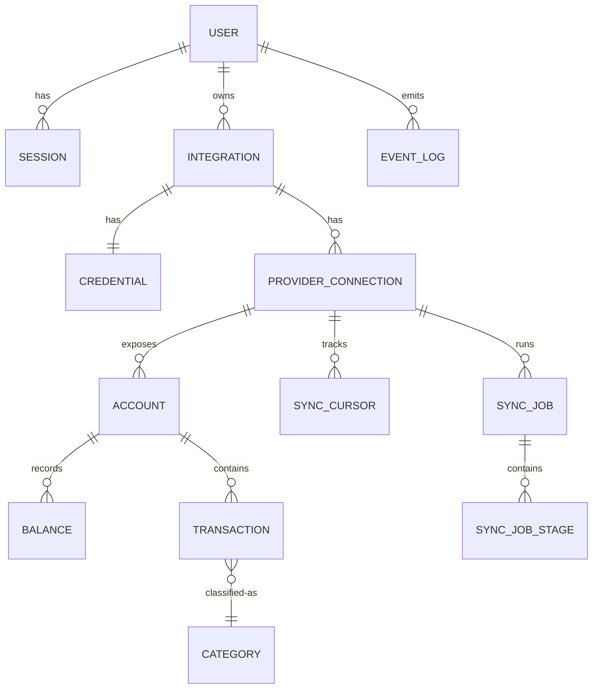

# ADR-0002: PostgreSQL + Drizzle ORM

| Field | Value |
|---|---|
| Status | Accepted |
| Date | 2026-07-20 |
| Author | Architect (byrdOS) |
| Supersedes | — |
| Superseded by | — |
| Inherits | ADR-0000 |
| Implements | §3 Domain-driven design, §6 Security-first, §10 Token optimization |

## Context

byrdOS needs a relational database for financial data with strong consistency guarantees, schema migrations, and type-safe queries. The ORM must work well with DDD aggregates and NestJS DI.

## Decision

| Area | Decision | Rationale |
|---|---|---|
| Database | PostgreSQL (managed: Neon or Supabase) | ACID, RLS, JSONB, battle-tested for financial data |
| ORM | Drizzle ORM (TypeScript schema) | Type-safe, lightweight, SQL-like query builder, no codegen |
| Migrations | drizzle-kit generate + migrate | Declarative TS schema → SQL diff; reviewed before commit |
| Schema location | `packages/db/schema/*.schema.ts` | One file per aggregate, composable via pgTable |

## Entity-Relationship Diagram

## Key Tables

| Table | Purpose | Notable columns |
|---|---|---|
| User | Identity | id, email, createdAt, status |
| Session | Refresh token records | id, userId, refreshHash, expiresAt, revokedAt |
| Integration | Top-level link | id, userId, providerId, status |
| Credential | Encrypted tokens | integrationId, cipher (AES-GCM), keyId, expiresAt |
| ProviderConnection | Per-item mapping | id, integrationId, externalId, productName, lastWebhookAt |
| Account | Provider account | id, connectionId, externalId, mask, type, subtype, name |
| Balance | Time-series of balances | id, accountId, current, available, currency, recordedAt |
| Transaction | Posted txn | id, accountId, externalId, amount (int cents), date, name, merchant, raw (JSONB), categoryHash |
| Category | Classification | id, userId, name, normName, kind |
| SyncCursor | Pagination state | connectionId, resourceType, cursor, updatedAt |
| SyncJob | Run record | id, connectionId, type, status, trigger, startedAt, finishedAt, error |
| SyncJobStage | Sub-stage status | jobId, stage, status, attempts, detail |
| EventLog | Outbox | id, aggregateType, aggregateId, type, payload, version, publishedAt |
| AuditLog | Sensitive ops | actor, action, target, meta, at |

## Modeling Decisions

- All monetary amounts stored as **integer cents** (no float).
- `Transaction.raw` JSONB preserves provider payload for replay/audit.
- Unique `(externalId, accountId)` enforces idempotency.
- `Balance` is append-only; current balance = latest row per account; also cached on `Account.currentBalanceCents` for fast reads, invalidated on sync.
- Soft deletes avoided; financial records immutable, corrections are new rows.
- Encryption: `Credential.cipher` AES-256-GCM with key reference `keyId` (key not in DB).

## Drizzle-Specific Notes

- Schema authored in TypeScript (`packages/db/schema/*.schema.ts`) — one file per aggregate, composed via `pgTable`.
- Relations declared with Drizzle `relations()` builder; not used for queries (joins written explicitly) but enables type inference and Graphify indexing.
- Migrations generated via `drizzle-kit generate` and committed; reviewed in PR.
- Apply with `drizzle-kit migrate` in deploy job; `drizzle.config.ts` reads `DATABASE_URL` from env.
- Query builder (`db.select().from(...)`) used inside repository implementations only — never leaked to services.
- Repository interfaces (in domain/contracts) return domain entities; mapping from Drizzle rows happens inside the repository implementation.
- RLS policies authored in raw SQL migrations (Drizzle does not manage RLS declaratively).

## Consequences

- Positive: Type-safe queries eliminate a class of runtime errors.
- Positive: Drizzle's SQL-like API keeps mental model close to Postgres.
- Negative: Drizzle is newer/less ecosystem than Prisma; fewer community recipes.
- Negative: RLS must be managed in raw SQL alongside Drizzle migrations.

## Changelog

| Date | Change | Author |
|---|---|---|
| 2026-07-20 | Accepted PostgreSQL + Drizzle ORM decision | Architect (byrdOS) |
