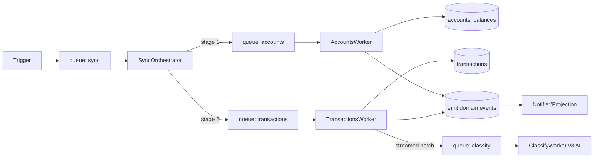

# ADR-0003: BullMQ on Redis for Sync Pipeline

| Field | Value |
|---|---|
| Status | Accepted |
| Date | 2026-07-20 |
| Author | Architect (byrdOS) |
| Supersedes | — |
| Superseded by | — |
| Inherits | ADR-0000 |
| Implements | §3 Domain-driven design, §11 Observability-first |

## 1. Context

byrdOS needs a reliable, observable job queue for the financial data synchronization pipeline. Sync jobs are multi-stage (accounts → transactions → classify), must support retries with backoff, and must be observable with spans per stage.

## 2. Decision

| Area | Decision | Rationale |
|---|---|---|
| Queue system | BullMQ on Redis (Upstash) | Redis already in stack (caching/sessions); BullMQ is mature, FlowProducer-friendly |
| Redis provider | Upstash (managed) | Serverless-friendly, free tier sufficient for early scale |
| Job orchestration | BullMQ FlowProducer (parent→fan-out→child jobs) | Clean dependency graph between stages |
| Worker deployment | Standalone NestJS app contexts per `services/*` | Reuse DI graph, no HTTP overhead |

## 3. Sync Pipeline Architecture



## 4. Queues

| Queue | Purpose | Concurrency | Rate Limit |
|---|---|---|---|
| sync | Orchestrator entry point | 5 | per-user |
| accounts | Fetch accounts + balances | 10 | per-provider |
| transactions | Fetch transactions (paginated) | 10 | per-provider |
| classify | AI category classification (stub v1) | 5 | — |
| webhooks | Inbound webhook processing | 10 | per-provider |
| outbox | Event relay to streams | 1 | — |
| notifications | Push/email dispatch | 5 | — |
| sync.dead | Dead letter queue (failed jobs) | — | — |

## 5. Sync Types

| Sync type | Trigger | Scope |
|---|---|---|
| Initial | On link complete | Full historical (configurable: 30/90/365d) |
| Incremental | Cron (every 4h) + webhook | Since last cursor |
| On-demand | User "Refresh now" | Since last cursor |
| Backfill | Manual/admin | Specified range |

## 6. Retry, Backoff, Idempotency

- Provider calls: exponential backoff `[1s, 2s, 4s, 8s, 30s]` + ±20% jitter, max 5 attempts
- Idempotency key per logical request: `<userId>:<operation>:<hash>`
- BullMQ: `attempts: 5`, `backoff: { type: 'exponential', delay: 2000 }`, `removeOnComplete: 100`, `removeOnFail: 1000`
- Dead-letter queue `sync.dead` after final failure; alerting via event
- Transactions worker uses cursor-based pagination from provider; stores last cursor on `SyncCursor`
- Idempotent upserts: `Transaction.externalId + accountId` unique constraint
- Rate-limiting: BullMQ `limiter` per provider (`max`, `duration`). Plaid-specific rate codes (`PRODUCTS_NOT_READY`) → backoff with jitter

## 7. Sync State Machine

```
queued → running → accounts_done → tx_done → completed | failed | partial
```

## 8. Scheduled Jobs (BullMQ repeatable)

| Job | Schedule | Description |
|---|---|---|
| scheduled-sync | every 4h per active connection | enqueue incremental sync |
| credential-refresh | daily 03:00 | refresh soon-expiring tokens (future OAuth) |
| outbox-relay | poll 1s | publish pending events to stream |
| balance-fastlane | every 30m | light balance-only sync |
| retention-purge | nightly 02:00 | drop raw older than 90d |
| deadletter-alert | poll 30m | emit alert for jobs stuck in DLQ |

## 9. Worker isolation

- Each worker (`sync-worker`, `webhook-worker`, `scheduler`) is a separate process
- Uses standalone NestJS app context (not HTTP) → reuses DI graph minus controllers
- OTEL spans created for each sync stage; parent trace propagated via job data

## 10. Consequences

- Positive: FlowProducer gives clean stage dependencies with partial failure handling
- Positive: BullMQ's built-in retry/backoff reduces custom retry code
- Negative: Redis becomes a critical path; if Redis is down, sync is paused
- Negative: FlowProducer graphs are harder to debug than linear queues; tracing is essential

## 11. Changelog

| Date | Change | Author |
|---|---|---|
| 2026-07-20 | Accepted BullMQ + Redis for sync pipeline | Architect (byrdOS) |
