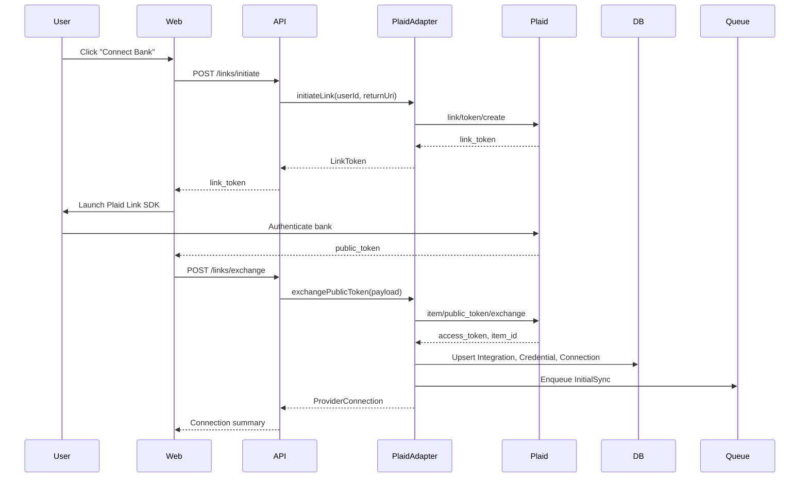

# ADR-0004: Auth.js, JWT Identity, and Provider OAuth Lifecycle

| Field | Value |
|---|---|
| Status | Accepted |
| Date | 2026-07-20 |
| Author | Architect (byrdOS) |
| Supersedes | — |
| Superseded by | — |
| Inherits | ADR-0000 |
| Implements | §6 Security-first, §7 Interface-first |

## Context

byrdOS needs a unified identity layer for the Next.js frontend, NestJS API, and asynchronous workers. The authentication system must support passwordless and social login flows, issue tokens that backend services can verify independently, and integrate cleanly with aggregator OAuth flows such as Plaid Link. This ADR applies ADR-0000 §6 (security-first development) and §7 (interface-first design) by selecting Auth.js v5 as the app-auth framework and defining the token contract before implementation.

## Decision

| Area | Decision |
|---|---|
| App auth | Auth.js (NextAuth v5) — Credentials + Google + Apple providers |
| Token strategy | JWT (asymmetric RS256) — short-lived access (15m) + refresh (30d, rotating) |
| Session storage | Postgres adapter (`Sessions` table) for revocation/audit |
| Backend verification | Verify JWT via shared JWKS/public key |
| CSRF | Auth.js handles; state param in OAuth; SameSite=Lax cookies |

### Access and refresh tokens

- Access tokens are signed JWTs with `exp` of 15 minutes, carried in `Authorization: Bearer` headers.
- Refresh tokens are opaque rotating tokens stored in the `Sessions` table with a 30-day expiry.
- Token rotation invalidates the previous refresh token on every use; reuse detection marks the session as compromised and revokes the family.
- Public keys are exposed via a JWKS endpoint so `apps/api` and services can verify access tokens without calling `apps/web`.

### Provider OAuth lifecycle (Plaid Link)

### Token refresh and relink

- Aggregator access tokens (e.g., Plaid `access_token`) are long-lived and stored as envelope-encrypted ciphertext (see ADR-0008).
- `ITEM_LOGIN_REQUIRED` webhooks emit a `RelinkRequired` domain event; the UI surfaces a re-link prompt that repeats the Plaid Link flow.
- Future direct OAuth providers will store refresh tokens encrypted and rotate them proactively via a scheduled job seven days before expiry.
- All token writes are audit-logged with token identifier and expiry timestamp; token values are never written to logs.

## Consequences

- **Positive**: Auth.js v5 has first-class Next.js App Router support and reduces custom session code.
- **Positive**: JWT with JWKS enables independent backend verification and horizontal scaling without shared session state.
- **Negative**: Refresh-token rotation adds complexity; reuse detection must be implemented and tested to prevent session hijacking.
- **Neutral**: The Postgres adapter introduces a small write overhead on every session mutation, offset by the audit and revocation benefits.

## Alternatives considered

- **Custom JWT/session layer** — rejected: Auth.js v5 already provides OAuth state management, CSRF protection, and provider abstractions with less custom security-sensitive code.
- **Opaque access tokens** — rejected: Adds a verification round-trip to the auth service on every API call; JWT verification via JWKS keeps services autonomous.

## Changelog

| Date | Change | Author |
|---|---|---|
| 2026-07-20 | Accepted Auth.js JWT identity and provider OAuth lifecycle decisions | Architect (byrdOS) |
