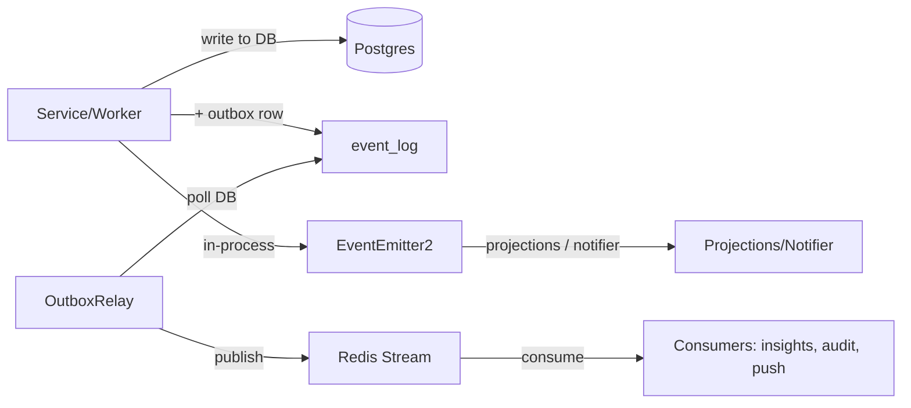

# ADR-0006: Outbox Eventing Pattern

| Field | Value |
|---|---|
| Status | Accepted |
| Date | 2026-07-20 |
| Author | Architect (byrdOS) |
| Supersedes | — |
| Superseded by | — |
| Inherits | ADR-0000 |
| Implements | §3 Domain-driven design, §11 Observability-first |

## Context

byrdOS is organized as bounded contexts that must communicate without direct service imports (ADR-0000 §3). Some consumers live in separate processes or services, so in-process events alone are insufficient. At the same time, cross-service events must be observable, reliable, and schema-stable (ADR-0000 §11). This ADR defines a hybrid eventing model that combines in-process domain events with an outbox-backed integration event pipeline.

## Decision

- Domain events are emitted in-process via `EventEmitter2` (NestJS) for same-process projections and notifiers.
- Integration events are persisted to an `event_log` table (outbox pattern) within the same transaction as the originating business write.
- `OutboxRelay` worker polls `event_log`, publishes events to Redis Streams, and marks them as published.
- Events are schema-versioned (e.g., `v1.TransactionSynced`) and defined in `packages/contracts`.

### Architecture

### Key events v1

- `IntegrationLinked`
- `CredentialsRefreshed`
- `AccountsSynced`
- `TransactionsSynced`
- `BalanceChanged`
- `SyncFailed`
- `ReauthRequired`
- `WebhookReceived`

Each event carries a standard envelope: `eventId`, `eventType`, `schemaVersion`, `aggregateId`, `payload`, `occurredAt`, and `correlationId` populated from the active OTEL trace context.

## Consequences

- **Positive**: The outbox pattern guarantees at-least-once delivery across services even if Redis or a consumer is temporarily unavailable.
- **Positive**: Schema versioning prevents breaking downstream consumers when payloads evolve.
- **Negative**: Cross-service events incur latency bounded by the outbox poll interval.
- **Negative**: The `event_log` table grows monotonically and requires a retention policy (e.g., archive published events after 30 days).

## Alternatives considered

- **Direct Redis publishes from services** — rejected: Loses durability if the publish fails after the DB commit; outbox keeps business writes and event emission atomic.
- **Saga/orchestrator workflow engine** — rejected: Adds unnecessary complexity for the bounded contexts and event volumes expected in M0–M3.

## Changelog

| Date | Change | Author |
|---|---|---|
| 2026-07-20 | Accepted outbox eventing pattern and v1 event catalog | Architect (byrdOS) |
