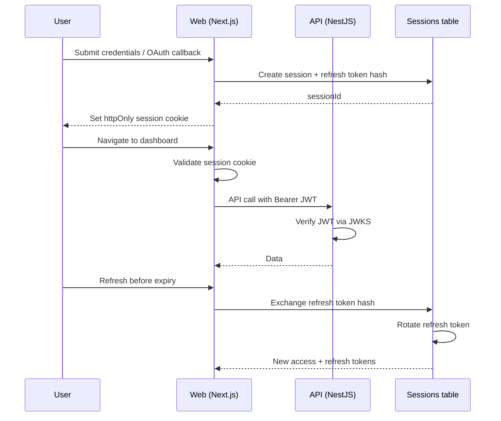
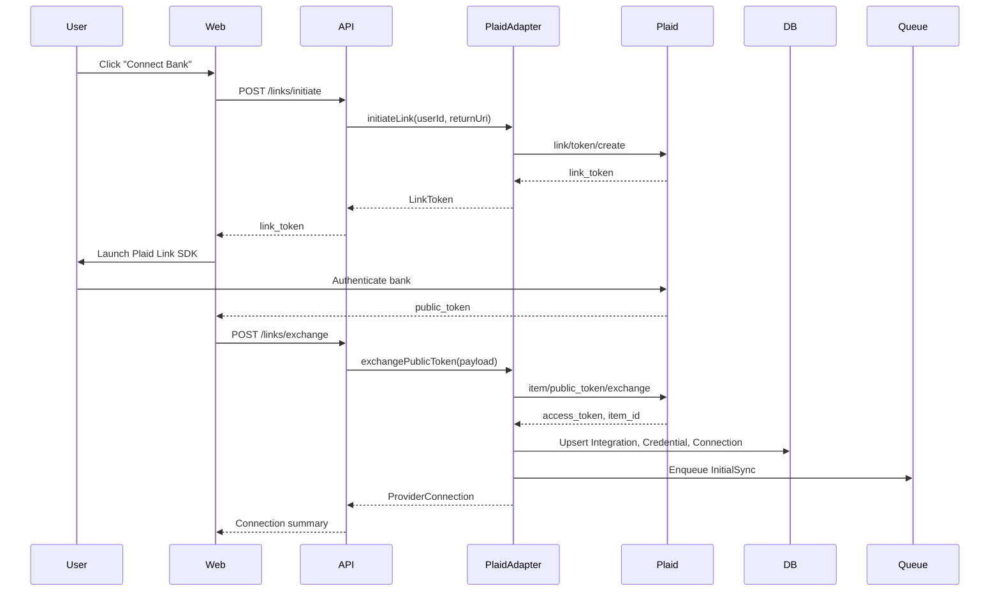

# Authentication and Identity

byrdOS uses Auth.js v5 (NextAuth) for application authentication and asymmetric JWTs (RS256) for service-to-service authorization. This document explains the session lifecycle, the Plaid Link OAuth flow, token refresh and relink behavior, and the backend JWT verification path.

The decisions are recorded in ADR-0004 and inherit ADR-0000 §6 (security-first development) and §7 (interface-first design).

## App auth: Auth.js + JWT

| Concern | Choice | Rationale |
|---|---|---|
| Framework | Auth.js v5 | First-class Next.js App Router support |
| Login methods | Credentials, Google, Apple | Passwordless and social options |
| Access token | JWT RS256, 15-minute expiry | Stateless, verifiable by any service |
| Refresh token | Opaque rotating token, 30-day expiry | Revocable, reuse detection |
| Session storage | PostgreSQL via Auth.js adapter | Revocation and audit |
| Backend verification | JWKS/public key endpoint | No shared session state |

## Token lifecycle

### Access token

- Signed JWT with claims: `sub` (user id), `email`, `iat`, `exp`, `iss`.
- Carried in `Authorization: Bearer <token>` headers from `apps/web` to `apps/api`.
- Refreshed silently by `apps/web` before expiry.

### Refresh token

- Opaque random string stored as a hash in the `Sessions` table.
- Rotated on every use; previous token invalidated.
- Reuse detection marks the session family as compromised and revokes all tokens.
- Expires after 30 days of inactivity.

### JWKS endpoint

`apps/web` exposes a JWKS endpoint (e.g., `/.well-known/jwks.json`) so `apps/api` and worker services can verify access tokens without calling the web app.

```typescript
// packages/auth/src/jwt.ts
export async function verifyAccessToken(token: string): Promise<JWTPayload> {
  const jwks = createLocalJWKSet(await fetchJwks());
  return jwtVerify(token, jwks, { issuer: ISSUER, algorithms: ['RS256'] });
}
```

## Session lifecycle



## OAuth lifecycle for Plaid Link

The provider OAuth lifecycle is separate from application auth. Plaid Link uses a short-lived `link_token` to launch the bank connection UI and returns a `public_token` that is exchanged for a long-lived `access_token`.



After the exchange:

1. The `access_token` is encrypted and stored in the `Credential` table.
2. A `ProviderConnection` row maps the Plaid `item_id` to a byrdOS connection id.
3. An `InitialSync` job is enqueued.
4. The UI subscribes to sync progress events.

## Token refresh and relink

### Aggregator access tokens

- Plaid `access_token`s are long-lived. They do not require periodic refresh.
- Future direct-OAuth providers (e.g., Varo OAuth) will store refresh tokens encrypted and rotate them proactively seven days before expiry via a scheduled job.

### ITEM_LOGIN_REQUIRED

When a provider signals that credentials expired (Plaid `ITEM_LOGIN_REQUIRED` webhook):

1. The `webhook-worker` verifies the webhook signature.
2. The `PlaidAdapter` raises `RelinkRequiredError`.
3. The `ProviderLink` context emits a `RelinkRequired` domain event.
4. The UI surfaces a re-link prompt.
5. The user repeats the Plaid Link flow; the existing `Integration` is updated in place.

```typescript
@OnEvent('provider-link.relink-required')
async handleRelinkRequired(event: RelinkRequiredEvent) {
  await this.notificationService.promptRelink(event.userId, event.connectionId);
}
```

### Audit

All token writes (create, rotate, revoke) are logged to `AuditLog` with the token identifier and expiry timestamp. Token values are never written to logs, per ADR-0000 §6.

## CSRF and cookie security

- Auth.js manages CSRF tokens and state parameters for OAuth.
- Session cookies are `httpOnly`, `Secure` in production, and `SameSite=Lax`.
- The `state` parameter in Plaid Link prevents CSRF on the exchange callback.
- Cross-origin API calls from `apps/web` to `apps/api` require explicit CORS allowlists.

## Backend JWT verification via JWKS

`apps/api` uses a NestJS guard to verify access tokens on every request.

```typescript
@Injectable()
export class JwtAuthGuard implements CanActivate {
  async canActivate(context: ExecutionContext): Promise<boolean> {
    const request = context.switchToHttp().getRequest();
    const token = extractBearerToken(request.headers.authorization);
    const payload = await verifyAccessToken(token);
    request.user = payload;
    return true;
  }
}
```

The guard:

1. Extracts the Bearer token.
2. Verifies the signature against the JWKS endpoint.
3. Validates `iss`, `aud`, and `exp`.
4. Attaches the payload to `request.user`.

Downstream services use the `userId` from `request.user` to enforce per-user authorization and RLS.

## Identity context

The `Identity` bounded context owns `User` and `Session` aggregates. It does not depend on provider logic. The Auth.js Postgres adapter maps to the same `Sessions` table used by the domain model.

## Consequences

- **Positive**: JWT verification via JWKS lets `apps/api` and workers scale horizontally without shared session state.
- **Positive**: Refresh-token rotation limits the blast radius of a leaked token.
- **Negative**: Reuse detection and rotation logic must be carefully tested to prevent session hijacking.
- **Negative**: The Postgres adapter adds a write on every session mutation.
