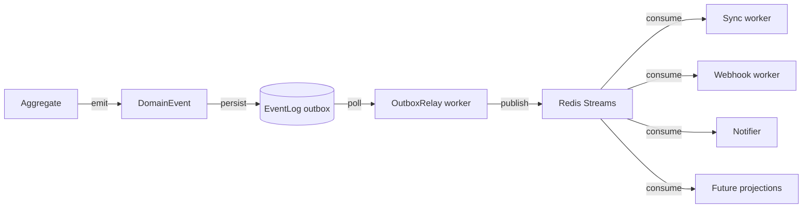

# Event Architecture

byrdOS uses two event layers: in-process domain events for cross-context communication inside a service, and integration events for cross-process communication between apps, workers, and future consumers. Both layers are durable, ordered, and observable.

This design implements ADR-0000 §3 (domain-driven design) and §11 (observability-first engineering).

## Domain events (in-process)

Domain events are emitted by aggregates and handled inside the same process via EventEmitter2.

### Event shape

```typescript
export interface DomainEvent {
  readonly type: string;
  readonly aggregateType: string;
  readonly aggregateId: string;
  readonly payload: Record<string, unknown>;
  readonly version: number;
  readonly occurredAt: Date;
}
```

### Naming convention

Events use `{context}.{event-name}` in kebab-case.

| Event | Aggregate | Emitted when |
|---|---|---|
| provider-link.integration-linked | Integration | User completes provider linking |
| provider-link.relink-required | Integration | Provider credentials expire |
| account.accounts-synced | Account | Accounts and balances are updated |
| sync.transactions-fetched | SyncJob | Transactions are persisted |
| transaction.transaction-classified | Transaction | Category assigned |
| sync.sync-completed | SyncJob | All sync stages succeed |

### Dispatch

Aggregates collect events during a transaction. The repository or application service publishes them after the transaction commits.

```typescript
export class AggregateRoot {
  private _events: DomainEvent[] = [];

  protected emit(event: DomainEvent): void {
    this._events.push(event);
  }

  pullEvents(): DomainEvent[] {
    const events = this._events;
    this._events = [];
    return events;
  }
}
```

### Handler rules

- Handlers are idempotent.
- Handlers operate on their own aggregate.
- Handlers do not call back into the originating service.
- Failed handlers do not roll back the originating transaction.

## Integration events (outbox + Redis Streams)

For events that must cross process boundaries, byrdOS uses the outbox pattern backed by PostgreSQL and relayed to Redis Streams.



### Why outbox

The outbox pattern guarantees that an event is published if and only if the transaction that produced it commits. Events are written to the same database transaction as the aggregate change, then relayed asynchronously.

### EventLog table

```typescript
export const eventLog = pgTable('event_log', {
  id: uuid('id').defaultRandom().primaryKey(),
  aggregateType: text('aggregate_type').notNull(),
  aggregateId: text('aggregate_id').notNull(),
  type: text('type').notNull(),
  payload: jsonb('payload').notNull(),
  version: integer('version').notNull(),
  publishedAt: timestamp('published_at'),
  createdAt: timestamp('created_at').defaultNow().notNull(),
});
```

### OutboxRelay worker

- Polls `EventLog` for rows where `publishedAt IS NULL`.
- Publishes each event to a Redis Stream.
- Marks the row as published in a separate transaction.
- Emits metrics and traces per event.

```typescript
@Injectable()
export class OutboxRelayWorker {
  async run(): Promise<void> {
    const events = await this.eventStore.pollUnpublished(100);
    for (const event of events) {
      await this.streamClient.xAdd('byrdos:events', '*', event);
      await this.eventStore.markPublished(event.id);
    }
  }
}
```

## Schema versioning

Events carry a `version` field. Consumers must handle versions they understand and ignore unknown versions.

| Version | Rule |
|---|---|
| 1 | Initial event schemas |
| 2+ | Additive changes only; no renamed or removed required fields |

When a breaking change is required, a new event type is introduced and the old type is deprecated with a sunset date.

## Key v1 events

### ProviderLink context

- `provider-link.integration-linked`
- `provider-link.relink-required`

### Account context

- `account.accounts-synced`

### Sync context

- `sync.transactions-fetched`
- `sync.sync-completed`
- `sync.sync-failed`

### Transaction context

- `transaction.transaction-classified`

### Notification context

- `notification.relink-prompt`
- `notification.sync-complete`

## Cross-context flow example

When a user links a bank:

1. ProviderLink aggregate emits `provider-link.integration-linked`.
2. Sync handler receives the event and enqueues an `InitialSync` job.
3. AccountsWorker emits `account.accounts-synced`.
4. Insight handler reacts by scheduling a first-run report.

No context imports another context's service directly.

## Consequences

- **Positive**: Outbox guarantees at-least-once delivery without two-phase commit.
- **Positive**: Redis Streams allows multiple consumers with consumer groups.
- **Negative**: Events are eventually consistent across processes.
- **Negative**: Schema evolution requires discipline to avoid consumer breakage.
