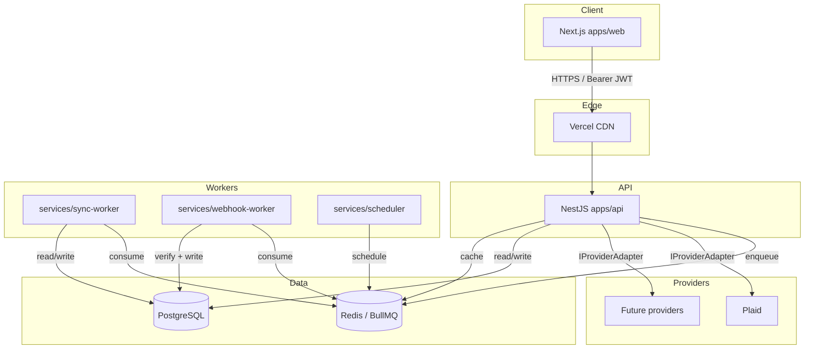
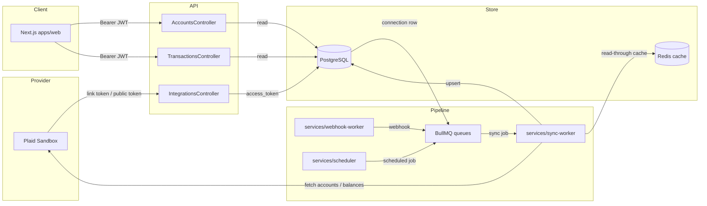
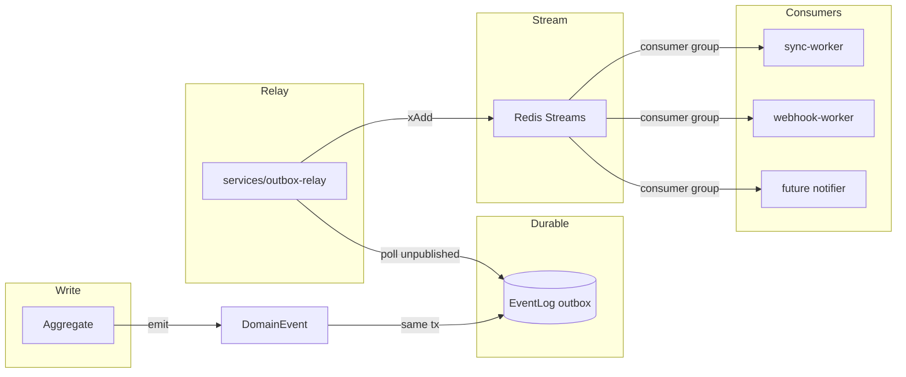

# byrdOS Architecture Overview

byrdOS is an AI-first personal operating system for finance. Its first production integration connects Varo Bank accounts, but every architectural choice is intentionally provider-agnostic so that banks, investment platforms, payroll providers, and budgeting tools can be added later without rewrites.

This document introduces the high-level system, the technology stack, and the monorepo layout. Detailed design for each area is in sibling documents under `docs/architecture/` and the decisions that shaped them are recorded as immutable ADRs in `docs/adr/`.

## What byrdOS is

- A **personal finance OS**: one place to link accounts, sync transactions, classify spending, build budgets, and receive insights.
- **AI-first**: contracts, tests, and interfaces are authored before implementation bodies; specialized agents own discrete concerns.
- **Provider-agnostic**: the `IProviderAdapter` boundary keeps Plaid-specific concepts out of services, DTOs, and domain models.
- **Modular and event-driven**: bounded contexts communicate through domain events, not direct service imports.

## Technology stack

| Layer | Technology | Decision record |
|---|---|---|
| Language | TypeScript (strict) | ADR-0001 §2 |
| Monorepo | pnpm workspaces + Turborepo | ADR-0001 §2 |
| Backend framework | NestJS | ADR-0001 §2 |
| Frontend framework | Next.js App Router | ADR-0001 §2 |
| Database | PostgreSQL (Neon/Supabase) | ADR-0002 |
| ORM | Drizzle ORM | ADR-0002 |
| Caching / sessions | Redis (Upstash) | ADR-0003 |
| Job queue | BullMQ on Redis | ADR-0003 |
| Auth | Auth.js v5 + JWT RS256 | ADR-0004 |
| Styling | Tailwind v4 + shadcn/ui | ADR-0001 §2 |
| Observability | pino + OpenTelemetry | ADR-0000 §11 |

The stack is chosen to keep agent context windows small and responsibilities explicit, per ADR-0000 §1 (AI-first development), §4 (modular architecture), and §10 (token optimization).

## System architecture



- **apps/web** serves the UI, handles Auth.js sessions, and prefetches data via React Server Components.
- **apps/api** is the REST gateway; it validates JWTs via JWKS, orchestrates application services, and enqueues sync jobs.
- **services/* ** are standalone NestJS app contexts without HTTP servers. They consume BullMQ jobs and process sync, webhooks, and scheduled work.
- **packages/*** contain shared domain models, contracts, database schema, adapters, and UI components.

## Monorepo layout

```
byrdos/
├─ apps/
│  ├─ web/                 # Next.js (App Router)
│  └─ api/                 # NestJS REST gateway
├─ services/
│  ├─ sync-worker/         # BullMQ sync job consumer
│  ├─ webhook-worker/      # Inbound provider webhooks
│  └─ scheduler/           # Cron producer
├─ packages/
│  ├─ config/              # Shared ESLint, Prettier, tsconfig
│  ├─ domain/              # Pure domain models, events, VOs
│  ├─ contracts/           # Zod DTOs shared FE↔BE
│  ├─ provider-sdk/        # IProviderAdapter + adapters
│  ├─ db/                  # Drizzle schema, migrations, client
│  ├─ auth/                # Auth.js config, JWT helpers
│  ├─ queue/               # BullMQ queue definitions
│  ├─ observability/       # pino, OTEL, metrics
│  ├─ ui/                  # shadcn/ui design system
│  └─ test-utils/          # Mock factories, test harness
├─ docs/
│  ├─ architecture/        # Long-form design docs
│  ├─ adr/                 # Architecture decision records
│  ├─ rfc/                 # Pre-decision proposals
│  ├─ roadmap/             # Delivery milestones
│  └─ diagrams/            # Mermaid sources
├─ turbo.json
├─ pnpm-workspace.yaml
└─ AGENTS.md
```

The layout is defined in ADR-0001 §3. Boundary rules are enforced by `eslint-plugin-boundaries` in CI, as required by ADR-0000 §4.

## Guiding principles

All architecture decisions inherit from ADR-0000:

1. **AI-first development** — small files, explicit types, contracts before bodies.
2. **Graphify as canonical memory** — every significant change has a Graphify update task.
3. **Domain-driven design** — bounded contexts, aggregates, domain events.
4. **Modular architecture** — one context per NestJS module; clear ownership.
5. **Provider-agnostic integrations** — no provider concept crosses `IProviderAdapter`.
6. **Security-first** — threat modeling at gates, encrypted tokens, per-user authz.
7. **Interface-first design** — contracts published before implementation.
8. **Testing requirements** — high coverage, ephemeral schemas, deterministic tests.
9. **Documentation standards** — immutable ADRs, inline Mermaid, OpenAPI from code.
10. **Token optimization** — agents read only Graphify-referenced files.
11. **Observability-first** — logs, metrics, and traces from day one.

## Data flow

The primary data flow moves financial data from providers through the sync
pipeline and into the read models consumed by the frontend.



1. **Link** — The frontend requests a Plaid Link token from
   `POST /links/initiate`, exchanges the public token via
   `POST /links/exchange`, and the API stores an encrypted provider connection.
2. **Schedule** — `services/scheduler` enqueues periodic and on-demand sync
   jobs on BullMQ queues (`sync`, `accounts`, `transactions`, `classify`).
3. **Sync** — `services/sync-worker` consumes jobs, calls the provider adapter,
   and upserts accounts, balances, and transactions into PostgreSQL.
4. **React** — Provider webhooks land in `services/webhook-worker`, are verified,
   and enqueue targeted sync jobs.
5. **Read** — The frontend fetches paginated accounts and transactions from
   `apps/api`, which reads from PostgreSQL and caches hot data in Redis.

This flow implements ADR-0005 (provider abstraction), ADR-0003 (BullMQ/Redis
sync pipeline), ADR-0006 (outbox eventing), and ADR-0008 (credential
encryption).

## Event flow

Cross-context communication uses domain events inside a process and the outbox
pattern across processes.



- **In-process**: Aggregates emit domain events; handlers in the same NestJS
  module react without direct service imports.
- **Outbox**: Events are persisted to the `event_log` table in the same
  transaction as the aggregate change, then relayed to Redis Streams by the
  `OutboxRelay` worker.
- **Consumers**: Workers subscribe to Redis Streams consumer groups for
  scalable, at-least-once delivery.

See `events.md` for event shapes and versioning, and ADR-0006 for the outbox
design rationale.

<!--
Swagger verification note (M4.5):
The API audit workstream is reviewing Swagger accuracy in parallel. Current
observations from apps/api/src/main.ts and the controller files:
- SwaggerModule.setup('docs') is invoked before app.setGlobalPrefix('api').
  In NestJS this typically serves Swagger at /docs, not /api/docs.
- The session controller (GET /me) lacks @ApiTags and @ApiBearerAuth decorators,
  so it may appear untagged or unauthenticated in Swagger.
- Several controllers use @ApiOperation but do not yet declare full response DTOs,
  so generated schemas may be incomplete.
These items should be resolved by the API audit workstream; this doc is updated
when the audit completes.
-->

## Next documents

- `monorepo.md` — package boundaries, ownership, and build orchestration.
- `ddd.md` — bounded contexts, aggregates, and the domain package.
- `provider-abstraction.md` — the `IProviderAdapter` contract and registry.
- `auth.md` — identity, sessions, and the Plaid Link OAuth lifecycle.
- `sync-pipeline.md` — BullMQ flow, workers, cursors, and retry behavior.
- `events.md` — domain and integration event architecture.
