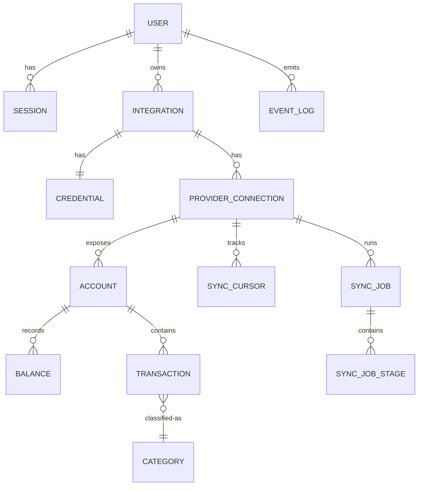

# Database Schema

byrdOS stores all relational data in PostgreSQL. The schema is designed around DDD aggregates, financial immutability, and multi-tenant isolation. This document describes the entity relationships, table responsibilities, and Drizzle-specific implementation notes.

The database decisions are recorded in ADR-0002 and inherit ADR-0000 §3 (domain-driven design) and §6 (security-first development).

## Entity-Relationship Diagram



## Table summaries

| Table | Purpose | Notable columns |
|---|---|---|
| User | Identity | id, email, createdAt, status |
| Session | Refresh token records | id, userId, refreshHash, expiresAt, revokedAt |
| Integration | Top-level provider link | id, userId, providerId, status |
| Credential | Encrypted tokens | integrationId, cipher (AES-GCM), keyId, expiresAt |
| ProviderConnection | Per-item mapping | id, integrationId, externalId, productName, lastWebhookAt |
| Account | Provider account | id, connectionId, externalId, mask, type, subtype, name |
| Balance | Time-series of balances | id, accountId, current, available, currency, recordedAt |
| Transaction | Posted transaction | id, accountId, externalId, amount (int cents), date, name, merchant, raw (JSONB), categoryHash |
| Category | Classification | id, userId, name, normName, kind |
| SyncCursor | Pagination state | connectionId, resourceType, cursor, updatedAt |
| SyncJob | Run record | id, connectionId, type, status, trigger, startedAt, finishedAt, error |
| SyncJobStage | Sub-stage status | jobId, stage, status, attempts, detail |
| EventLog | Outbox | id, aggregateType, aggregateId, type, payload, version, publishedAt |
| AuditLog | Sensitive ops | actor, action, target, meta, at |

## Modeling decisions

### Integer cents for money

All monetary amounts are stored as integer cents. No floats are used for financial values.

```typescript
amountCents: integer('amount_cents').notNull(),
availableCents: integer('available_cents').notNull(),
currentCents: integer('current_cents').notNull(),
```

### Immutable financial records

Financial records are append-only or immutable. Corrections are new rows, not updates.

- `Balance` is append-only. The current balance is the latest row per account.
- `Transaction` rows are never deleted; disputes or reversals create new rows.
- `Account.currentBalanceCents` is cached for fast reads and invalidated on sync.

### Append-only balances

```typescript
export const balances = pgTable('balances', {
  id: uuid('id').defaultRandom().primaryKey(),
  accountId: uuid('account_id').notNull().references(() => accounts.id),
  currentCents: integer('current_cents').notNull(),
  availableCents: integer('available_cents').notNull(),
  currency: text('currency').notNull().default('USD'),
  recordedAt: timestamp('recorded_at').defaultNow().notNull(),
});
```

### Encryption envelope

Credentials and tokens are stored as encrypted blobs. The encryption key is referenced by `keyId` but never stored in the database.

```typescript
export const credentials = pgTable('credentials', {
  id: uuid('id').defaultRandom().primaryKey(),
  integrationId: uuid('integration_id').notNull().references(() => integrations.id),
  cipher: text('cipher').notNull(),        // AES-256-GCM ciphertext
  iv: text('iv').notNull(),                // Initialization vector
  authTag: text('auth_tag').notNull(),     // GCM auth tag
  keyId: text('key_id').notNull(),         // Key reference, not the key
  expiresAt: timestamp('expires_at'),
  createdAt: timestamp('created_at').defaultNow().notNull(),
});
```

### Idempotency

- `Transaction` unique constraint: `(externalId, accountId)`.
- `Account` unique constraint: `(connectionId, externalId)`.
- `SyncJob` duplicate prevention via `(connectionId, type, trigger)` plus timestamp.

### No soft deletes

Soft deletes are avoided for financial data. Records are immutable or append-only. User-initiated deletions are modeled as explicit `status` transitions or anonymization jobs.

## Drizzle-specific notes

### TypeScript schema

Schema files live in `packages/db/src/schema/*.schema.ts`, one file per aggregate.

```typescript
// packages/db/src/schema/account.schema.ts
export const accounts = pgTable('accounts', {
  id: uuid('id').defaultRandom().primaryKey(),
  connectionId: uuid('connection_id').notNull().references(() => providerConnections.id),
  externalId: text('external_id').notNull(),
  name: text('name').notNull(),
  type: text('type').notNull(),
  subtype: text('subtype'),
  mask: text('mask'),
  currentBalanceCents: integer('current_balance_cents').notNull().default(0),
  currency: text('currency').notNull().default('USD'),
  createdAt: timestamp('created_at').defaultNow().notNull(),
});

export const accountsRelations = relations(accounts, ({ one, many }) => ({
  connection: one(providerConnections, { fields: [accounts.connectionId], references: [providerConnections.id] }),
  balances: many(balances),
  transactions: many(transactions),
}));
```

### Relations

Drizzle `relations()` is declared for type inference and Graphify indexing, but queries use explicit joins inside repositories.

### Migrations

Migrations are generated with `drizzle-kit generate` and committed to `packages/db/src/migrations/`.

```bash
pnpm turbo run db:generate --filter=db
```

Apply migrations with `drizzle-kit migrate` during deployment:

```bash
pnpm turbo run db:migrate --filter=db
```

### Row-level security

RLS policies are authored in raw SQL migrations. Drizzle does not manage RLS declaratively.

```sql
ALTER TABLE accounts ENABLE ROW LEVEL SECURITY;

CREATE POLICY accounts_user_isolation ON accounts
  FOR ALL
  USING (user_id = current_setting('app.current_user_id')::uuid);
```

The application sets `app.current_user_id` on each connection from the authenticated JWT `sub` claim.

### Repository mapping

Repository implementations map between Drizzle rows and domain entities. The query builder is never leaked outside the repository layer.

```typescript
async findById(id: string): Promise<Account | null> {
  const row = await this.db.query.accounts.findFirst({ where: eq(accounts.id, id) });
  return row ? this.toDomain(row) : null;
}
```

## Multi-tenancy

Every user-facing table includes `userId` and is protected by RLS. Application code passes the authenticated `userId` to repository methods as a defense-in-depth measure beyond RLS.

## Consequences

- **Positive**: Integer cents eliminate float rounding errors.
- **Positive**: Append-only balances provide a complete audit trail.
- **Positive**: Encryption envelope keeps keys out of the database.
- **Negative**: RLS requires raw SQL migrations alongside Drizzle schema files.
- **Negative**: Append-only tables grow over time and require retention policies.
