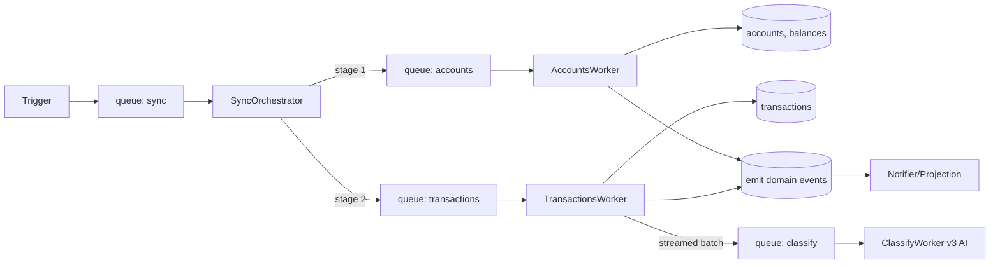

# Synchronization Pipeline

The sync pipeline moves financial data from providers into byrdOS. It is implemented as a set of BullMQ queues and workers, orchestrated by `BullMQ FlowProducer`, so that stages can fail independently and retry without corrupting downstream work.

The pipeline design is decided in ADR-0003 and inherits ADR-0000 §3 (domain-driven design) and §11 (observability-first engineering).

## Sync types

| Type | Trigger | Scope |
|---|---|---|
| **Initial** | On link complete | Full historical window (configurable: 30/90/365 days) |
| **Incremental** | Cron every 4h + webhook | Since last cursor |
| **On-demand** | User clicks "Refresh now" | Since last cursor |
| **Backfill** | Admin/manual | Specified date range |

Each sync type becomes a `SyncJob` row with a `type` field and follows the same state machine.

## Pipeline stages



1. **Trigger** enqueues a job on the `sync` queue.
2. **SyncOrchestrator** (a FlowProducer job) creates child jobs for accounts and transactions.
3. **AccountsWorker** fetches accounts and balances, upserts them, and emits `AccountsSynced`.
4. **TransactionsWorker** fetches transactions with cursor-based pagination and emits `TransactionsFetched`.
5. **ClassifyWorker** consumes batches of unclassified transactions and assigns categories (v1 is a deterministic stub; v3 will use AI).
6. **Domain events** are emitted after each successful stage for projections and notifications.

## BullMQ FlowProducer orchestration

`FlowProducer` creates a dependency graph of jobs. Child jobs run when their parents complete.

```typescript
await flowProducer.add({
  name: 'sync',
  queueName: 'sync',
  data: { connectionId, type: 'incremental' },
  children: [
    { name: 'accounts', queueName: 'accounts', data: { connectionId } },
    {
      name: 'transactions',
      queueName: 'transactions',
      data: { connectionId },
      children: [
        { name: 'classify', queueName: 'classify', data: { connectionId } },
      ],
    },
  ],
});
```

## Workers

| Worker | Queue | Concurrency | Rate limit |
|---|---|---|---|
| `SyncOrchestrator` | `sync` | 5 | per-user |
| `AccountsWorker` | `accounts` | 10 | per-provider |
| `TransactionsWorker` | `transactions` | 10 | per-provider |
| `ClassifyWorker` | `classify` | 5 | — |

### AccountsWorker

- Resolves the provider adapter from `ProviderRegistry`.
- Calls `fetchAccounts` and `fetchBalances`.
- Upserts `Account` rows and appends `Balance` rows.
- Emits `AccountsSynced` domain event.

### TransactionsWorker

- Reads the last `SyncCursor` for the connection.
- Calls `fetchTransactions` with the cursor.
- Upserts transactions using the `(externalId, accountId)` unique constraint for idempotency.
- Stores the new cursor.
- Enqueues classify jobs in batches.
- Emits `TransactionsFetched`.

### ClassifyWorker (v1 stub)

- Reads unclassified transactions from a batch.
- Applies deterministic rules (merchant name → category mapping).
- In v3, this worker will call an AI classification service.
- Emits `TransactionClassified`.

## Cursor-based pagination

Providers return cursors instead of offsets. The worker stores the latest cursor per `(connectionId, resourceType)` in the `SyncCursor` table.

```typescript
export interface SyncCursor {
  connectionId: string;
  resourceType: 'accounts' | 'transactions';
  cursor: string;
  updatedAt: Date;
}
```

- Initial sync starts with an empty cursor.
- Incremental sync starts with the stored cursor.
- If a cursor is missing, the worker falls back to a configurable lookback window.

## Idempotency

- `SyncJob` rows are keyed by `(connectionId, type, trigger)` plus a timestamp to prevent duplicate enqueues.
- Transaction upserts use the unique constraint `(externalId, accountId)`.
- Account upserts use `(connectionId, externalId)`.
- Idempotency key for provider calls: `<userId>:<operation>:<hash>`.

## Rate limiting

BullMQ `limiter` throttles workers per provider. Plaid-specific rate codes are normalized to `ProviderRateLimitError` with a `retryAfterMs` hint.

```typescript
new Worker('transactions', processor, {
  connection: redis,
  limiter: { max: 100, duration: 60000 },
});
```

Provider calls use exponential backoff with jitter: `[1s, 2s, 4s, 8s, 30s]`.

## Sync state machine

```
queued → running → accounts_done → tx_done → completed | failed | partial
```

| State | Meaning |
|---|---|
| `queued` | Job waiting on BullMQ |
| `running` | Orchestrator started |
| `accounts_done` | Accounts stage succeeded |
| `tx_done` | Transactions stage succeeded |
| `completed` | All stages succeeded |
| `partial` | Some stages failed but non-fatal |
| `failed` | Final failure after retries |

`SyncJobStage` records per-stage status and attempt counts.

## Retry and dead-letter behavior

- BullMQ attempts: 5.
- Backoff: exponential with `delay: 2000` and ±20% jitter.
- `removeOnComplete: 100`, `removeOnFail: 1000`.
- After final failure, jobs move to `sync.dead`.
- A scheduled job emits an alert for stuck dead-letter jobs.

## Scheduled jobs

BullMQ repeatable jobs are produced by `services/scheduler`.

| Job | Schedule | Description |
|---|---|---|
| `scheduled-sync` | every 4h per active connection | Enqueue incremental sync |
| `credential-refresh` | daily 03:00 | Refresh soon-expiring tokens (future OAuth) |
| `outbox-relay` | poll 1s | Publish pending events to stream |
| `balance-fastlane` | every 30m | Light balance-only sync |
| `retention-purge` | nightly 02:00 | Drop raw payloads older than 90d |
| `deadletter-alert` | every 30m | Alert for jobs stuck in DLQ |

## Worker isolation

Each worker is a separate process with a standalone NestJS app context (no HTTP server). This reuses the DI graph minus controllers and keeps failure domains small.

## Tracing

Every sync stage is an OTEL span. The parent trace id is propagated via job data so that a single sync flow can be traced end-to-end across workers.

```typescript
@InjectQueue('transactions') private readonly txQueue: Queue,
// job data includes { traceId, spanId }
```

## Consequences

- **Positive**: FlowProducer cleanly models stage dependencies and partial failures.
- **Positive**: Workers are independently scalable.
- **Negative**: Redis is on the critical path; if Redis is down, sync pauses.
- **Negative**: FlowProducer graphs are harder to debug than linear queues; tracing is essential.
