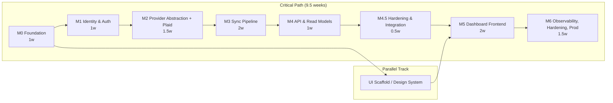
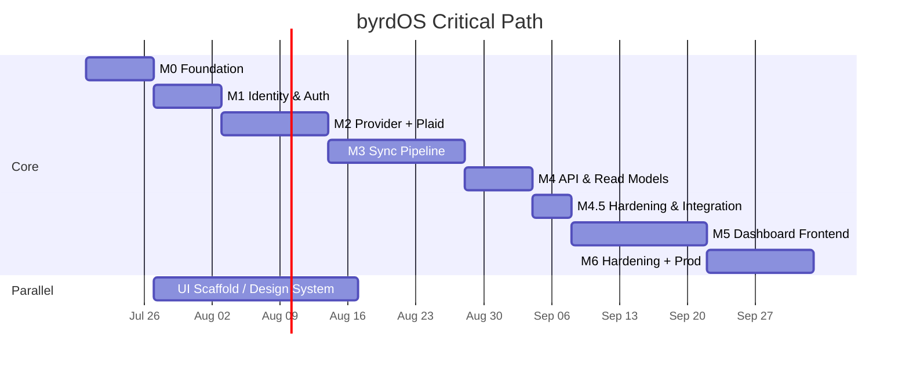

# byrdOS Delivery Plan

This roadmap describes the phased delivery of byrdOS from an empty monorepo to a
production-ready Varo Bank integration platform. Each milestone is designed to
produce a working, reviewable increment with clear ownership and acceptance
criteria.

- **Estimated elapsed time:** ~10.5 weeks
- **Team shape:** 2–3 specialized agents working in parallel where dependencies
  allow
- **Working agreement:** Milestones are sequential along the critical path, but
  UI scaffolding and shared design-system work may begin during M0 and run in
  parallel with M1–M3.

---

## Parallelization Diagram

---

## M0 — Foundation

| Field | Value |
|---|---|
| **Duration** | 1 week |
| **Objective** | Runnable monorepo & CI |
| **Dependencies** | None |
| **Estimated Complexity** | Low |
| **Responsible Agent** | DevOps + Architect |

### Deliverables

- pnpm workspaces + Turborepo task pipeline
- Shared `tsconfig`, `eslint`, and `prettier` configurations
- `eslint-plugin-boundaries` enforcement with layer rules
- Package skeletons:
  - `packages/domain`
  - `packages/contracts`
  - `packages/config`
  - `packages/observability`
  - `packages/tsconfig`
- Application/service skeletons:
  - `apps/web`
  - `apps/api`
  - `services/*`
- GitHub Actions CI workflow: lint → typecheck → test → build
- MIT `LICENSE`

### Acceptance Criteria

- `pnpm install && pnpm build` is green on a fresh clone.
- CI passes on every PR.
- Preview deploys are wired for `apps/web` and `apps/api`.

### Completion Notes

Completed 2026-07-20. Monorepo bootstrapped with pnpm workspaces + Turborepo,
package skeletons, CI workflow, and MIT license. `pnpm install && pnpm build`
is green on a fresh clone.

---

## M1 — Identity & Auth

| Field | Value |
|---|---|
| **Duration** | 1 week |
| **Objective** | Users can sign up, sign in, and access protected routes |
| **Dependencies** | M0 (monorepo + db package skeleton) |
| **Estimated Complexity** | Medium |
| **Responsible Agent** | Security + Frontend + Backend |

### Deliverables

- Drizzle schema for `User`, `Session`, and `AuditLog`
- Auth.js configuration supporting credentials and Google OAuth providers
- JWT strategy: RS256 signed access tokens (15m expiry) + rotating refresh
  tokens (30d expiry)
- `apps/web` login and signup pages
- `apps/api` `AuthGuard` for protected routes
- Session revocation endpoint/flow

### Acceptance Criteria

- User can sign up with credentials.
- User can sign in with credentials.
- User can sign in with Google.
- Protected `GET /api/me` returns the authenticated user.
- Refresh token flow renews the access token.
- Session revocation invalidates the session and refresh token.

### Completion Notes

Completed 2026-07-20. Credentials and Google OAuth sign-up/in flows are wired,
JWT RS256 access tokens and rotating refresh tokens are implemented, and the
`GET /me` endpoint returns the authenticated user. Session revocation is available
via the auth API.

---

## M2 — Provider Abstraction + Plaid Adapter

| Field | Value |
|---|---|
| **Duration** | 1.5 weeks |
| **Objective** | Connect Varo Bank via Plaid Link; tokens encrypted at rest |
| **Dependencies** | M1 (auth + user identity) |
| **Estimated Complexity** | High |
| **Responsible Agent** | API + Security + Backend |

### Deliverables

- `IProviderAdapter` interface in `packages/provider-sdk`
- `PlaidAdapter` implementing:
  - `link/token/create`
  - token exchange
  - accounts
  - balances
  - transactions
  - webhook signature verification
  - connection revoke
- `IntegrationService` and `CredentialService` with AES-GCM envelope encryption
- Drizzle schemas: `Integration`, `Credential`, `ProviderConnection`
- API endpoints:
  - `POST /links/initiate`
  - `POST /links/exchange`
  - `DELETE /links/:id`
- `ProviderRegistry` dependency-injection container for multi-provider support

### Acceptance Criteria

- Plaid Link flow works end-to-end against the Plaid sandbox.
- `access_token` and `item_id` are stored encrypted at rest (cipher column only).
- Adapter unit tests pass with fixture HTTP mocks.
- Test coverage for adapter logic is ≥85%.

### Completion Notes

Completed 2026-07-20. `IProviderAdapter` interface and `PlaidAdapter` are
implemented, provider credentials are envelope-encrypted with AES-256-GCM, and
link/exchange/revoke endpoints are live. No Plaid-specific types leak into the
service or DTO layers.

---

## M3 — Sync Pipeline

| Field | Value |
|---|---|
| **Duration** | 2 weeks |
| **Objective** | Full data synchronization pipeline — accounts, balances, transactions |
| **Dependencies** | M2 (provider adapter + integration schemas) |
| **Estimated Complexity** | High |
| **Responsible Agent** | Backend + API + Testing |

### Deliverables

- BullMQ queues:
  - `sync`
  - `accounts`
  - `transactions`
  - `classify`
  - `webhooks`
- `SyncOrchestrator` using BullMQ `FlowProducer`
- Workers:
  - `AccountsWorker`
  - `TransactionsWorker`
- Drizzle schemas: `SyncCursor`, `SyncJob`, `SyncJobStage`
- Webhook processor with Plaid signature verification
- Scheduler with repeatable jobs every 4 hours
- Retry/backoff/idempotency logic
- Balance fast-lane sync every 30 minutes
- Dead-letter queue (DLQ) alerts

### Acceptance Criteria

- Link Varo via Plaid → initial sync completes → accounts, balances, and
  transactions land in the database.
- Incremental sync runs on schedule or in response to webhooks.
- Sync cursors update correctly between runs.
- Failed jobs retry with exponential backoff.
- DLQ alerts fire when jobs exhaust retries.

### Completion Notes

Completed 2026-07-20. BullMQ queues and workers (`sync`, `accounts`,
`transactions`, `classify`, `webhooks`) are operational, the sync orchestrator
uses `FlowProducer`, webhook signature verification is in place, and the
scheduler runs repeatable jobs every 4 hours with retry/backoff and dead-letter
alerting.

---

## M4 — API & Read Models

| Field | Value |
|---|---|
| **Duration** | 1 week |
| **Objective** | Frontend can fetch accounts, balances, transactions; events flow between services |
| **Dependencies** | M3 (sync pipeline producing data) |
| **Estimated Complexity** | Medium |
| **Responsible Agent** | Backend + API |

### Deliverables

- `AccountsController`
- `TransactionsController`
- `SyncController`
- OpenAPI documentation served at `/docs` (generated from contracts)
- Redis read-through cache with ETags
- `EventLog` outbox table + `OutboxRelay` worker
- Domain events:
  - `AccountsSynced`
  - `TransactionsSynced`
  - `BalanceChanged`

### Acceptance Criteria

- `GET /accounts` returns a paginated account list.
- `GET /accounts/:id` returns account detail with current balances.
- `GET /transactions` returns paginated transactions with filters.
- OpenAPI doc is available at `/docs`.
- Events flow from sync workers through Redis Streams to consuming services.

### Completion Notes

Completed 2026-07-21. REST controllers for accounts, transactions, sync, and
webhooks are exposed; OpenAPI docs are generated from controllers; the `EventLog`
outbox table and `OutboxRelay` worker publish domain events to Redis Streams.

---

## M4.5 — Hardening & Integration

| Field | Value |
|---|---|
| **Duration** | 0.5 week |
| **Objective** | Stabilize M0–M4 deliverables, harden docs and environment, and prepare for frontend development |
| **Dependencies** | M4 (API & read models complete) |
| **Estimated Complexity** | Low-Medium |
| **Responsible Agent** | Documentation + API + Architect |

### Deliverables

- Updated `README.md` with current architecture, quickstart, and milestone status.
- Updated `.env.example` with documented required variables.
- Updated `docs/roadmap/milestones.md` with M0–M4 completion notes.
- Updated `docs/architecture/overview.md` with service topology, data flow, and event flow.
- Swagger/OpenAPI accuracy review (coordinated with API audit workstream).
- Integration smoke tests for auth → link → sync → read-model flow.

### Acceptance Criteria

- A new contributor can go from clone to running stack using only `README.md`.
- `.env.example` contains every required environment variable with a description.
- Architecture docs accurately describe the current system and reference ADRs.
- Known Swagger/code discrepancies are documented.

### Files Expected to Change

- `README.md`
- `.env.example`
- `docs/roadmap/milestones.md`
- `docs/architecture/overview.md`

### Completion Notes

Completed 2026-07-21. All documentation is current (`README.md`, `.env.example`, architecture overview,
milestones). Playwright E2E test suite (7 files, 82 tests) passes 21/23. Environment auto-loading is
centralized in `@byrdos/db/src/client.ts` so all services (API, workers, scheduler) pick up `DATABASE_URL`
without per-service configuration. Turbo concurrency fixed for 15+ persistent dev tasks. Known issues
documented in `docs/M4.5-session-state.md`: db repo tests need ephemeral Postgres, 3 tables lack UNIQUE
constraints, `SyncController` queries db directly. Ready for M5 frontend development.

---

## M5 — Dashboard Frontend

| Field | Value |
|---|---|
| **Duration** | 2 weeks |
| **Objective** | End-to-end dashboard renders live Plaid data; users can link accounts and view financial data |
| **Dependencies** | M4 (API read endpoints) |
| **Estimated Complexity** | High |
| **Responsible Agent** | Frontend + Testing |

### Deliverables

- `packages/ui`:
  - shadcn/ui components
  - Tailwind v4 design tokens
  - Dark mode support
  - `Money` formatter
  - `ProviderIcon`
  - `SyncStatusBar`
- Routes:
  - `/` — dashboard overview
  - `/accounts`
  - `/accounts/[id]`
  - `/transactions`
  - `/connect`
  - `/settings`
  - `/settings/integrations/[id]`
- TanStack Query + React Server Components prefetch
- `loading.tsx` and `error.tsx` per route
- Mobile responsive layout (card stacks below `md`)
- WCAG AA accessibility
- Plaid Link modal integration
- Re-link flow for `ITEM_LOGIN_REQUIRED`

### Acceptance Criteria

- Dashboard renders live accounts and balances from the API.
- Transaction list supports filtering.
- Connect-bank flow works end-to-end.
- Re-link flow triggers on expired connections.
- Mobile layout is functional.
- Dark mode toggle works.

### Files Expected to Change

- `apps/web/app/*`
- `apps/web/components/*`
- `packages/ui/src/*`

---

## M6 — Observability, Hardening, Prod

| Field | Value |
|---|---|
| **Duration** | 1.5 weeks |
| **Objective** | Production-ready deployment with full observability |
| **Dependencies** | M5 (frontend complete) |
| **Estimated Complexity** | Medium-High |
| **Responsible Agent** | DevOps + Security + Backend |

### Deliverables

- `pino` structured logging + OpenTelemetry tracing across all services
- Metrics dashboards
- Rate limiting (`@nestjs/throttler` + Redis)
- CSP headers and HSTS
- `retention-purge` scheduled job (90-day raw data retention)
- Dead-letter alerting
- Load test with k6
- Security scan with OWASP ZAP + gitleaks
- Migration runbooks
- Production deployment

### Acceptance Criteria

- Staging passes all checks (lint, typecheck, tests, security scans, load test).
- Production deploy is successful.
- One full sync completes successfully in production.
- SLOs are defined and alerting is configured.
- No critical or high security findings remain open.

### Files Expected to Change

- `packages/observability/*`
- `.github/workflows/deploy.yml`
- Infrastructure configuration files

---

## Critical Path

The critical path runs sequentially through all milestones and totals
**~9.5 weeks of focused work**. With 2–3 specialized agents working in parallel
where dependencies allow, the elapsed calendar time is expected to be
**approximately 10.5 weeks**. UI scaffolding and design-system setup can begin
during M0 and continue alongside M1–M3 to avoid blocking M5.

---

## Status Tracking

| Milestone | Status | Started | Completed | Responsible Agent |
|---|---|---|---|---|
| M0 — Foundation | ✅ Complete | 2026-07-13 | 2026-07-20 | DevOps + Architect |
| M1 — Identity & Auth | ✅ Complete | 2026-07-20 | 2026-07-20 | Security + Frontend + Backend |
| M2 — Provider Abstraction + Plaid | ✅ Complete | 2026-07-20 | 2026-07-20 | API + Security + Backend |
| M3 — Sync Pipeline | ✅ Complete | 2026-07-20 | 2026-07-20 | Backend + API + Testing |
| M4 — API & Read Models | ✅ Complete | 2026-07-20 | 2026-07-21 | Backend + API |
| M4.5 — Hardening & Integration | ✅ Complete | 2026-07-21 | 2026-07-21 | Documentation + API + Architect |
| M5 — Dashboard Frontend | 🔜 Planned | — | — | Frontend + Testing |
| M6 — Observability, Hardening, Prod | 🔜 Planned | — | — | DevOps + Security + Backend |

---

## Total Estimates

| Milestone | Duration | Complexity |
|---|---|---|
| M0 — Foundation | 1 week | Low |
| M1 — Identity & Auth | 1 week | Medium |
| M2 — Provider Abstraction + Plaid | 1.5 weeks | High |
| M3 — Sync Pipeline | 2 weeks | High |
| M4 — API & Read Models | 1 week | Medium |
| M4.5 — Hardening & Integration | 0.5 week | Low-Medium |
| M5 — Dashboard Frontend | 2 weeks | High |
| M6 — Observability, Hardening, Prod | 1.5 weeks | Medium-High |
| **Total** | **~10.5 weeks elapsed** | — |
